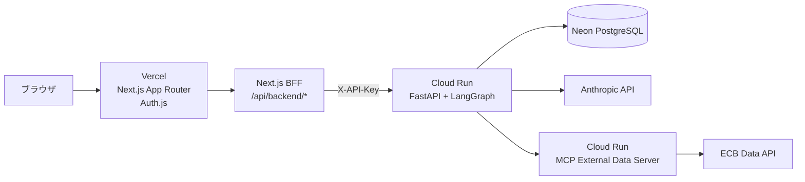

# STP Exception Triage Agent

証券会社の STP (Straight-Through Processing) 失敗取引を、ルールチェックと LangGraph エージェントで調査するデモアプリケーションです。フロントエンドは Next.js App Router、認証は Auth.js、バックエンドは FastAPI + LangGraph、データベースは Neon PostgreSQL を想定しています。

## アーキテクチャ概要

詳細は [docs/architecture.md](docs/architecture.md) を参照してください。

| レイヤー | 技術 |
| --- | --- |
| Frontend | Next.js / React / TypeScript / App Router / Auth.js |
| BFF | Next.js Route Handler (`/api/backend/[...path]`) |
| Backend | Python 3.12 / FastAPI / LangGraph / LangChain |
| Database | Neon PostgreSQL / SQLAlchemy 2.0 / Alembic |
| AI | Claude via Anthropic API、RAG 用 OpenAI Embeddings |
| External data | MCP external-data server on Cloud Run |
| Hosting | Vercel (frontend) + Cloud Run (backend and MCP server) |
| CI/CD | Vercel Git Integration + GitHub Actions |



## 主な特徴

- FO/BO のルールチェック結果に基づくトリアージ
- LangGraph の StateGraph、ReAct ループ、Human-in-the-Loop (HITL)
- 取引、カウンターパーティ、SSI、参照データ、STP 例外の管理画面
- Next.js BFF によるバックエンド API キーの秘匿
- Auth.js Credentials Provider による単一管理者ログイン
- LLM コストログ、ルール一覧、設定画面
- Vercel Preview / Production と Cloud Run デプロイの分離

## 前提条件

- Python 3.12+
- `uv` または `pip`
- Node.js 20.9+
- PostgreSQL 接続先 (Neon 推奨)
- Anthropic API キー
- 必要に応じて OpenAI API キー

## セットアップ

### 1. リポジトリを取得

```bash
git clone https://github.com/inash03/deep_agent_test.git
cd deep_agent_test
```

### 2. バックエンド環境変数を設定

```bash
cp .env.example .env
```

主な変数:

| 変数 | 用途 |
| --- | --- |
| `ANTHROPIC_API_KEY` | LangGraph エージェントから Claude を呼び出すためのキー |
| `OPENAI_API_KEY` | RAG/Embeddings を使う場合のキー |
| `DATABASE_URL` | PostgreSQL 接続 URL |
| `API_KEY` | FastAPI の保護対象エンドポイントで要求する API キー |
| `CORS_ORIGINS` | 許可するフロントエンド URL |
| `MCP_EXTERNAL_DATA_URL` | 外部データ MCP サーバの SSE URL |

### 3. Python 依存関係をインストール

```bash
uv pip install -e ".[dev]"
# または
pip install -e ".[dev]"
```

### 4. DB マイグレーションとシード

```bash
alembic upgrade head
python -m src.infrastructure.seed
```

## ローカル起動

### バックエンド

```bash
uvicorn src.main:app --reload
```

API ドキュメント: http://localhost:8000/docs

### フロントエンド

```bash
cd frontend
npm install
cp .env.example .env.local
npm run dev
```

フロントエンド: http://localhost:3000

`frontend/.env.local` には Next.js/BFF/Auth.js 用の値を設定します。

| 変数 | 用途 |
| --- | --- |
| `BACKEND_API_URL` | BFF が転送する FastAPI の URL |
| `BACKEND_API_KEY` | BFF が FastAPI に送る `X-API-Key` |
| `AUTH_SECRET` | Auth.js のセッション/JWT 保護用シークレット |
| `APP_USERNAME` | 初期管理者ユーザー名 |
| `APP_PASSWORD_HASH` | bcrypt でハッシュ化した初期管理者パスワード |

パスワードハッシュの作成例:

```bash
node -e "import('bcryptjs').then(async bcrypt => console.log(await bcrypt.hash('your-password', 10)))"
```

## テスト

```bash
# Python unit tests
pytest

# Frontend type check
cd frontend
npm run lint

# Next.js production build
npm run build

# Playwright smoke tests
npm run test:e2e
```

## デプロイ

### フロントエンド

Vercel Git Integration を使います。

- Vercel Project Root Directory: `frontend`
- Feature branch / Pull Request: Preview Deployment
- `main` へのマージ: Production Deployment
- 必要な環境変数: `BACKEND_API_URL`, `BACKEND_API_KEY`, `AUTH_SECRET`, `APP_USERNAME`, `APP_PASSWORD_HASH`

### バックエンド

GitHub Actions の `.github/workflows/deploy.yml` で Cloud Run にデプロイします。フロントエンドの旧デプロイ経路は廃止済みです。

GitHub Environment に残す主な値:

- `GCP_PROJECT_ID`
- `GCP_SA_KEY`
- `CORS_ORIGINS`

## API 概要

バックエンド API は `/api/v1/*` で提供されます。ブラウザからは直接呼ばず、Next.js BFF の `/api/backend/*` 経由でアクセスします。

| 領域 | 主なエンドポイント |
| --- | --- |
| Trades | `GET /api/v1/trades`, `POST /api/v1/trades`, `GET /api/v1/trades/{trade_id}` |
| FO/BO Triage | `POST /api/v1/trades/{trade_id}/fo-triage`, `POST /api/v1/trades/{trade_id}/bo-triage` |
| History | `GET /api/v1/triage/history` |
| STP Exceptions | `GET/POST/PATCH /api/v1/stp-exceptions` |
| Counterparties | `GET/PATCH /api/v1/counterparties` |
| SSI | `GET/PATCH /api/v1/ssis` |
| Reference Data | `GET /api/v1/reference-data` |
| Rules / Settings / Cost | `GET /api/v1/rules`, `GET/PATCH /api/v1/settings`, `GET /api/v1/cost/*` |

## ディレクトリ構成

```text
deep_agent_test/
  src/                         # FastAPI, domain, infrastructure
  mcp_server/                  # external-data MCP server
  frontend/                    # Next.js App Router frontend
    src/app/                   # App Router routes and API route handlers
    src/screens/               # migrated UI screens
    src/components/            # shared UI components
    src/api/                   # browser-side API client for BFF
  tests/                       # backend tests
  alembic/                     # database migrations
  docs/                        # English project documentation
  .github/workflows/deploy.yml # Cloud Run deployment
```

## 開発メモ

- フロントエンド UI の通常画面は英語表記です。
- Home 画面だけは英語/日本語の表示切替を持ちます。デフォルトは英語です。
- ブラウザに `BACKEND_API_KEY` を出さないため、API 呼び出しは必ず BFF 経由にします。
- 本番リリース単位は Git tag / GitHub Release で管理し、画面上には `package.json` の version と Vercel commit SHA を表示します。
