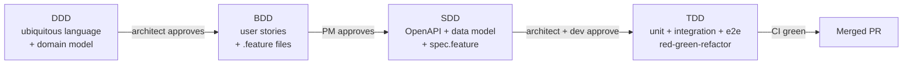

# AI-Driven Development Process

This document defines how a small team (roughly 5–10 people) builds this
application with AI coding agents such as Claude Code. It combines four
disciplines — **DDD, BDD, SDD, and TDD** — into a single pipeline where each
phase produces a reviewed artifact that becomes the input to the next phase.

It is written for both humans and agents. Humans use it to understand the
process and the review gates. Agents use it to know which artifact to read,
which artifact to produce, and what they must not do in each phase.

## 1. Why artifacts, not conversations

The core idea is that **every phase produces an artifact that is the interface
between humans and agents**. Agents do not rely on chat history; they rely on
approved documents. This gives three properties that matter at team scale:

1. **Artifacts compress context.** An agent that reads an approved glossary,
   feature file, and OpenAPI contract produces consistent output across
   sessions, even when the operator or the model changes.
2. **Artifacts are review gates.** Reviewing a Gherkin scenario or an OpenAPI
   diff is far cheaper for a human than reviewing the equivalent code. We push
   review earlier, where it is cheap.
3. **Quality comes from the verification loop, not model intelligence.** The
   stronger the machine-checkable gates (executable Gherkin, contract tests,
   CI), the less the outcome depends on having a frontier model. See
   [Section 7](#7-working-with-non-frontier-models).

### Why separate agents per phase

Using a different agent per phase is valuable not because the agents differ,
but because of what the separation buys:

- **Context isolation** — design discussion is not polluted by implementation
  trial-and-error.
- **Specialized role prompts** — each phase has a focused instruction set
  (a skill, see [Section 6](#6-agent-control-files)).
- **Human approval gates between phases** — only an approved artifact flows
  forward.

The same model can play every role. Splitting *sessions* per phase already
captures most of the benefit. What must not be skipped is the **approval gate**
between phases.

## 2. The pipeline at a glance



Each phase: **a phase-specific agent generates a draft → a human owner reviews
and approves via PR → only the approved artifact becomes the next phase's
input.** Unapproved intermediate output is never carried forward.

## 3. Repository-level artifacts (whole-application layer)

These live permanently in the repository, above the per-feature artifacts.
**All diagrams are text-based (Mermaid).** A `.drawio` file or a PNG is invisible
to an agent and cannot be diffed in a PR; a Mermaid block can be read, written,
and reviewed like code.

| Artifact | Location | Represents | Updated when |
| --- | --- | --- | --- |
| Architecture overview | `docs/architecture.md` | C4 context/container view, stack, deploy topology | Architecture changes |
| ADR (decision records) | `docs/adr/NNNN-*.md` | Why a decision was made; one decision per file, append-only | Each significant technical decision |
| Glossary (ubiquitous language) | `docs/domain/glossary.md` | Shared team vocabulary; the source of naming | DDD phase, incrementally |
| Domain model | `docs/domain/model.md` | Structure of business concepts (Mermaid `classDiagram`) | DDD phase |
| Context map | `docs/domain/context-map.md` | Bounded contexts and their relationships | DDD phase |
| Non-functional requirements | `docs/requirements.md` (NFR section) | Performance, availability, security acceptance criteria | Reviewed periodically |
| Test strategy | `docs/testing.md` | Harness rules, test pyramid, coverage matrix | Strategy changes |
| Requirement coverage | `docs/requirements.md` | FR-xx mapped to implementation and tests | Feature completion |

**ADRs matter most in an enterprise setting.** An agent does not know *why a
design was not chosen*, so it tends to silently undo earlier decisions. Reading
the ADR log prevents this. See `docs/adr/README.md`.

## 4. Per-feature artifacts (the DDD → BDD → SDD → TDD pipeline)

### DDD — Domain-Driven Design (owner: architect)

- Do not regenerate from scratch each time. Work as a **diff PR** against the
  existing glossary, model, and context map. This phase only activates when a
  feature introduces a new business concept.
- Agent instruction pattern: *"Extract the concepts this feature newly
  introduces, and flag any conflict with the existing glossary."*

| Artifact | Format | Represents | Read by |
| --- | --- | --- | --- |
| Glossary | Markdown | Shared team vocabulary | Everyone |
| Domain model | Mermaid / Markdown | Structure of business concepts | Everyone |
| Context map | Mermaid | Service boundaries | Architect, engineers |

### BDD — Behavior-Driven Design (owner: PM)

- **Gherkin that is not executed will rot.** This is the single decisive point
  for BDD. Bind step definitions (`pytest-bdd` on the backend, Playwright-BDD
  for E2E) and **run the feature files in CI**. A non-executable feature is just
  Markdown and stops being trusted the moment it diverges from code.
- User stories live in the GitHub Issue body; feature files live in `features/`
  and are reviewed by the PM in the PR. Gherkin is the last artifact a
  non-engineer can review, so this is the PM's main gate.

| Artifact | Format | Represents | Read by |
| --- | --- | --- | --- |
| Feature file | Gherkin `.feature` | User-facing usage scenario | PM and engineers |
| User story | Markdown (Issue) | Who wants what, and why | PM, everyone |

### SDD — Specification-Driven Design (owner: architect + implementing engineer)

- **OpenAPI is machine-verified**: lint with Spectral; CI checks that an
  OpenAPI diff is accompanied by updated contract tests; optionally fuzz the
  contract with schemathesis. The spec is canonical; the implementation
  follows.
- The data-model spec is a pair: a Markdown description plus the Alembic
  migration.
- `spec.feature` (detailed scenarios) takes the BDD feature down to an
  implementable granularity, including edge and error cases. **This is the
  direct input to the TDD agent.**

| Artifact | Format | Represents | Read by |
| --- | --- | --- | --- |
| API spec | OpenAPI YAML / Markdown | Endpoint contract | Engineers |
| Data-model spec | Markdown + Alembic | Data structure and constraints | Engineers |
| Detailed scenario spec | Gherkin `spec.feature` | Implementable behavior incl. errors | Engineers, AI |
| Error / NFR acceptance | Markdown / Gherkin | Non-happy-path and NFR criteria | Engineers |
| Observability spec | Markdown | Which logs/metrics are part of the contract | Engineers |

### TDD — Test-Driven Development (owner: engineers + CI)

- The existing red-green-refactor loop and harness strategy in
  `docs/testing.md` and `CLAUDE.md` already match best practice and are reused
  as-is.
- Add a per-PR **AI code review** (see the `code-review` and `security-review`
  skills) so human review can focus on conformance to `spec.feature`.

| Artifact | Format | Represents | Read by |
| --- | --- | --- | --- |
| Unit test | Python / TypeScript | Function/class behavior | Engineers, CI |
| Integration test | Python / TypeScript | API / cross-service behavior | Engineers, CI |
| E2E test | Playwright | End-to-end screen flow | Engineers, CI |
| Contract test | schemathesis / Pact | OpenAPI ↔ implementation drift | Engineers, CI |

## 5. Task tracking at team scale

A single `docs/tasks.md` is excellent for solo development but does not scale to
5–10 people: it conflicts under concurrent edits, has no owner/priority/audit
trail, and cannot be the source of truth for parallel agent sessions.

- **Move the source of truth to GitHub Issues / Projects.**
  One Issue = one feature (or scenario group) = one branch = one agent session.
- **Issue template** embeds the artifact checklist:

  ```markdown
  ## Artifact checklist
  - [ ] Glossary diff (or state "no change")
  - [ ] features/xxx.feature (PM approved)
  - [ ] OpenAPI diff / data-model diff (architect approved)
  - [ ] spec.feature
  - [ ] Tests green / CI green
  ```

- `docs/tasks.md` is **demoted** to an in-branch working note / agent plan
  scratchpad. It is no longer the shared, multi-person state.
- **PR template** requires links to the corresponding feature file, spec, and
  ADR. **CODEOWNERS** makes `docs/domain/` and `docs/adr/` require architect
  approval.

## 6. Agent control files

### Hierarchical CLAUDE.md / AGENTS.md

- **The root file is an index.** Keep process rules and "read this document
  when…" pointers at the root; delegate detail to the linked documents. This
  matters most under context pressure with non-frontier models.
- **Per-directory files** (`frontend/CLAUDE.md`, `src/CLAUDE.md`) hold only the
  conventions needed in that area. Agents read what is under their working
  directory, which saves context.
- If multiple agent products are used, treat **AGENTS.md** (the open standard)
  as canonical and keep `CLAUDE.md` / `.codex.md` as thin pointers to it. This
  repository already mirrors guidance into `CLAUDE.md`, `.codex.md`, and
  `.openai/`.

### The `.claude/` directory

```
.claude/
  settings.json          # shared permission allowlist + hooks (committed)
  skills/                # phase skills (slash commands)
    ddd-update/          # /ddd-update     glossary + model diff
    bdd-feature/         # /bdd-feature    story -> .feature
    sdd-spec/            # /sdd-spec       feature -> OpenAPI + data model + spec.feature
    tdd-implement/       # /tdd-implement  spec -> red-green-refactor
  agents/                # subagent definitions (reviewer, researcher)
```

- **Phases are encoded as skills.** This is the most maintainable form of
  "a different agent per phase". Each skill states its input artifact, its
  output format, and what it must not do (e.g. *the SDD skill never writes
  implementation code*).
- **Hooks enforce mechanical discipline** (format on edit, block direct push to
  `main`, reject dangerous commands). Enforcement beats asking the model, and
  the weaker the model the larger the effect.
- The `settings.json` permission allowlist is committed and shared so judgement
  does not drift between operators. In an enterprise, ship the hard
  prohibitions as managed (org-level) settings.

## 7. Working with non-frontier models

In environments where a frontier model (e.g. Fable 5) is unavailable and only
an Opus-level model can be used, the strategy is to **replace reliance on model
intelligence with specification detail and machine verification**.

1. **Smaller task granularity.** Split work into half-day units (a few
   `spec.feature` scenarios). Small PRs help human review too.
2. **Thicker SDD.** The weaker the model, the more specification ambiguity
   turns into rework. Specify `spec.feature` and OpenAPI to the point where
   little implementation freedom remains. Phase separation is itself a
   compensation for weaker models.
3. **Do not trust self-reports; judge by machine.** Completion is defined by CI
   (lint / types / unit / contract / executed Gherkin), not by the agent saying
   "tests pass". A hook can forbid committing while tests fail. The existing
   "do not report done until checks pass 100%" rule already encodes this.
4. **Conserve context.** Hierarchical CLAUDE.md, indexed docs, and delegating
   research to subagents to keep the main session clean.
5. **Route models per phase.** Use the strongest available model for DDD/SDD
   design judgement and code review; use a cheaper model for routine
   implementation once the spec is locked. A sufficiently detailed spec lowers
   the model requirement of the implementation phase — the hidden economic
   benefit of this process.
6. **Add human gates.** Reviews a frontier model might let you skip are kept at
   every phase boundary. The SDD-artifact review is the highest-leverage gate:
   one code-review's worth of effort prevents several rounds of rework.

## 8. Team operation (5–10 people)

- **Roles.** PM owns BDD-artifact approval. One or two architects own
  DDD/SDD artifacts and ADRs. Engineers run TDD and peer code review. Do not
  let the same person both drive the agent and approve the artifact for the
  same feature, or the review becomes a formality.
- **Parallel development.** Trunk-based with short-lived branches; branch
  protection requires CI. One person / one session / one Issue so agent work
  does not collide.
- **Measurement.** Track DORA metrics (deploy frequency, change-failure rate,
  lead time) plus "PR review round-trips" and "agent task first-pass success
  rate" so process changes are argued from evidence.

## 9. Staged rollout

Adopting everything at once guarantees the process becomes a formality. We roll
out in three phases. Status of each phase is tracked in `docs/progress.md`.

| Phase | Adds | Status |
| --- | --- | --- |
| Phase 1 | Executable Gherkin (BDD), ADRs, domain docs (glossary/model/context map), the phase skills, and the move toward Issue-driven tasks | In progress |
| Phase 2 | SDD: OpenAPI as the canonical contract, contract tests in CI, `spec.feature` | Planned |
| Phase 3 | Per-phase subagents, AI code review wired into CI, model routing, managed settings | Planned |

The biggest risk is **document rot**. The governing rule is one line:
**do not create a specification that CI does not execute or verify.** Execute
the Gherkin, run OpenAPI through contract tests, enforce glossary review with
CODEOWNERS. Adding unverified documents is worse than skipping the phase.

## 10. Phase-by-phase quick reference for agents

| You are asked to… | Skill | Read first | Produce | Never do |
| --- | --- | --- | --- | --- |
| Capture domain concepts | `/ddd-update` | glossary, model, context map | diff PR to `docs/domain/*` | write code or tests |
| Write usage scenarios | `/bdd-feature` | glossary, the Issue/story | `features/*.feature` | invent API or data shapes |
| Specify the contract | `/sdd-spec` | feature file, glossary | OpenAPI diff, data-model spec, `features/specs/*.spec.feature` | write implementation code |
| Implement | `/tdd-implement` | `spec.feature`, OpenAPI | failing test → code → green | skip the failing-test step |
