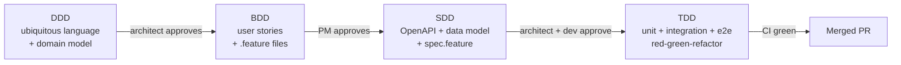

# AI-Driven Development Process

This document defines how a small team (roughly 5–10 people) builds this
application with AI coding agents such as Claude Code. It combines four
disciplines — **DDD, BDD, SDD, and TDD** — into a single pipeline where each
phase produces a reviewed artifact that becomes the input to the next phase.

It is written for both humans and agents. Humans use it to understand the
process and the review gates. Agents use it to know which artifact to read,
which artifact to produce, and what they must not do in each phase.

> **Triggering and cost:** who starts each phase (you or the pipeline) and which
> credential the agent runs on (flat-rate subscription — interactive *or* an
> OAuth token — vs per-token API) are selected by the `PHASE_DISPATCH_MODE` /
> `PR_REVIEW_MODE` variables and summarized in
> [§5, "Operating modes and billing"](#operating-modes-and-billing-convenience-vs-cost).
> Auto-dispatch is **off by default**. Read it before enabling any automation.

## 1. Why artifacts, not conversations

The core idea is that **every phase produces an artifact that is the interface
between humans and agents**. Agents do not rely on chat history; they rely on
approved documents. This gives three properties that matter at team scale:

1. **Artifacts compress context.** An agent that reads an approved glossary,
   feature file, and OpenAPI contract produces consistent output across
   sessions, even when the operator or the model changes.
2. **Artifacts are review gates.** Reviewing a Gherkin scenario or an OpenAPI
   diff is far cheaper for a human than reviewing the equivalent code. We push
   review earlier, where it is cheap.
3. **Quality comes from the verification loop, not model intelligence.** The
   stronger the machine-checkable gates (executable Gherkin, contract tests,
   CI), the less the outcome depends on having a frontier model. See
   [Section 7](#7-working-with-non-frontier-models).

### Why separate agents per phase

Using a different agent per phase is valuable not because the agents differ,
but because of what the separation buys:

- **Context isolation** — design discussion is not polluted by implementation
  trial-and-error.
- **Specialized role prompts** — each phase has a focused instruction set
  (a skill, see [Section 6](#6-agent-control-files)).
- **Human approval gates between phases** — only an approved artifact flows
  forward.

The same model can play every role. Splitting *sessions* per phase already
captures most of the benefit. What must not be skipped is the **approval gate**
between phases.

## 2. The pipeline at a glance


```mermaid
flowchart LR
    DDD["DDD\nubiquitous language\n+ domain model"] -->|architect approves| BDD
    BDD["BDD\nuser stories\n+ .feature files"] -->|PM approves| SDD
    SDD["SDD\nOpenAPI + data model\n+ spec.feature"] -->|architect + dev approve| TDD
    TDD["TDD\nunit + integration + e2e\nred-green-refactor"] -->|CI green| Done["Merged PR"]
```

Each phase: **a phase-specific agent generates a draft → a human owner reviews
and approves via PR → only the approved artifact becomes the next phase's
input.** Unapproved intermediate output is never carried forward.

## 3. Repository-level artifacts (whole-application layer)

These live permanently in the repository, above the per-feature artifacts.
**All diagrams are text-based (Mermaid).** A `.drawio` file or a PNG is invisible
to an agent and cannot be diffed in a PR; a Mermaid block can be read, written,
and reviewed like code.

| Artifact | Location | Represents | Updated when |
| --- | --- | --- | --- |
| Architecture overview | `docs/architecture.md` | C4 context/container view, stack, deploy topology | Architecture changes |
| ADR (decision records) | `docs/adr/NNNN-*.md` | Why a decision was made; one decision per file, append-only | Each significant technical decision |
| Glossary (ubiquitous language) | `docs/domain/glossary.md` | Shared team vocabulary; the source of naming | DDD phase, incrementally |
| Domain model | `docs/domain/model.md` | Structure of business concepts (Mermaid `classDiagram`) | DDD phase |
| Context map | `docs/domain/context-map.md` | Bounded contexts and their relationships | DDD phase |
| Non-functional requirements | `docs/requirements.md` (NFR section) | Performance, availability, security acceptance criteria | Reviewed periodically |
| Test strategy | `docs/testing.md` | Harness rules, test pyramid, coverage matrix | Strategy changes |
| Requirement coverage | `docs/requirements.md` | FR-xx mapped to implementation and tests | Feature completion |

**ADRs matter most in an enterprise setting.** An agent does not know *why a
design was not chosen*, so it tends to silently undo earlier decisions. Reading
the ADR log prevents this. See `docs/adr/README.md`.

## 4. Per-feature artifacts (the DDD → BDD → SDD → TDD pipeline)

### DDD — Domain-Driven Design (owner: architect)

- Do not regenerate from scratch each time. Work as a **diff PR** against the
  existing glossary, model, and context map. This phase only activates when a
  feature introduces a new business concept.
- Agent instruction pattern: *"Extract the concepts this feature newly
  introduces, and flag any conflict with the existing glossary."*

| Artifact | Format | Represents | Read by |
| --- | --- | --- | --- |
| Glossary | Markdown | Shared team vocabulary | Everyone |
| Domain model | Mermaid / Markdown | Structure of business concepts | Everyone |
| Context map | Mermaid | Service boundaries | Architect, engineers |

### BDD — Behavior-Driven Design (owner: PM)

- **Gherkin that is not executed will rot.** This is the single decisive point
  for BDD. Bind step definitions (`pytest-bdd` on the backend, Playwright-BDD
  for E2E) and **run the feature files in CI**. A non-executable feature is just
  Markdown and stops being trusted the moment it diverges from code.
- User stories live in the GitHub Issue body; BDD feature files live in
  `features/bdd/` and are reviewed by the PM in the PR. Gherkin is the last artifact a
  non-engineer can review, so this is the PM's main gate.

| Artifact | Format | Represents | Read by |
| --- | --- | --- | --- |
| Feature file | Gherkin `.feature` | User-facing usage scenario | PM and engineers |
| User story | Markdown (Issue) | Who wants what, and why | PM, everyone |

### SDD — Specification-Driven Design (owner: architect + implementing engineer)

- **OpenAPI is machine-verified**: lint with Spectral; CI checks that an
  OpenAPI diff is accompanied by updated contract tests; optionally fuzz the
  contract with schemathesis. The spec is canonical; the implementation
  follows.
- The data-model spec is a pair: a Markdown description plus the Alembic
  migration.
- `spec.feature` (detailed scenarios) takes the BDD feature down to an
  implementable granularity, including edge and error cases. **This is the
  direct input to the TDD agent.**

| Artifact | Format | Represents | Read by |
| --- | --- | --- | --- |
| API spec | OpenAPI YAML / Markdown | Endpoint contract | Engineers |
| Data-model spec | Markdown + Alembic | Data structure and constraints | Engineers |
| Detailed scenario spec | Gherkin `spec.feature` | Implementable behavior incl. errors | Engineers, AI |
| Error / NFR acceptance | Markdown / Gherkin | Non-happy-path and NFR criteria | Engineers |
| Observability spec | Markdown | Which logs/metrics are part of the contract | Engineers |

### TDD — Test-Driven Development (owner: engineers + CI)

- The existing red-green-refactor loop and harness strategy in
  `docs/testing.md` and `CLAUDE.md` already match best practice and are reused
  as-is.
- Add a per-PR **AI code review** (see the `code-review` and `security-review`
  skills) so human review can focus on conformance to `spec.feature`.

| Artifact | Format | Represents | Read by |
| --- | --- | --- | --- |
| Unit test | Python / TypeScript | Function/class behavior | Engineers, CI |
| Integration test | Python / TypeScript | API / cross-service behavior | Engineers, CI |
| E2E test | Playwright | End-to-end screen flow | Engineers, CI |
| Contract test | schemathesis / Pact | OpenAPI ↔ implementation drift | Engineers, CI |

## 5. Task tracking at team scale

A single `docs/tasks.md` is excellent for solo development but does not scale to
5–10 people: it conflicts under concurrent edits, has no owner/priority/audit
trail, and cannot be the source of truth for parallel agent sessions.

- **Move the source of truth to GitHub Issues / Projects.**
  One Issue = one feature (or scenario group) = one branch = one agent session.
- **Issue template** embeds the artifact checklist:

  ```markdown
  ## Artifact checklist
  - [ ] Glossary diff (or state "no change")
  - [ ] features/bdd/xxx.feature (PM approved)
  - [ ] OpenAPI diff / data-model diff (architect approved)
  - [ ] features/sdd/xxx.spec.feature
  - [ ] Tests green / CI green
  ```

### Filing a feature: parent Issue + phase sub-issues

Filing is a **hybrid** of an agent and an automation, split by where each is
strong:

- **Parent Issue — agent (`/feature-issue`).** The skill turns a user story
  into **one parent Issue** (`.github/ISSUE_TEMPLATE/feature.yml`): user story,
  acceptance criteria, artifact checklist (the roll-up summary), current phase.
  This is the part that needs feature-specific reasoning — translating the
  story into English and writing good acceptance criteria — so an agent authors
  it, draft-then-approve (it shows the draft and files only after the operator
  approves, since this is outward-facing).
- **Four phase sub-issues — automation (`create-phase-subissues` workflow).**
  When the parent is opened with the `feature` label, a GitHub Action files
  **four sub-issues**, one per phase (`.github/ISSUE_TEMPLATE/phase-subissue.yml`
  is the shape), and links each to the parent via GitHub's sub-issue
  relationship. Each states that phase's inputs (parent Issue + prior phase's
  approved artifact), the artifact to produce, the owner, and its acceptance.
  This content is fixed boilerplate that does not vary by feature, so it is
  produced **deterministically**: no tokens, always exactly four, no drift from
  the phase skills, and it fires on issue creation without anyone running a
  skill. The Action is idempotent (skips if sub-issues already exist) and only
  the parent carries the `feature` label, so sub-issues never re-trigger it.
- `feature.yml` (the parent) and `phase-subissue.yml` (the four children) are
  complementary, not competing: `feature.yml` stays the roll-up — whole-story,
  acceptance criteria, and the artifact checklist as a summary — while each
  sub-issue is the actionable, phase-scoped task a phase skill reads.
- **All four sub-issues are always filed**, even when a phase is expected to
  be a no-op (e.g. DDD with no new domain concept). The sub-issue is closed
  with that verdict instead of being skipped, so the parent's artifact
  checklist and the sub-issue set never drift apart. This is exactly what makes
  the sub-issues good **phase-completion tracking**: the open/closed state of
  the four children is the source of truth for how far a feature has advanced.
- **Closing a phase signals the next one — automation (`phase-advance`
  workflow).** When a `phase-subissue` closes, a GitHub Action reads its phase
  (the `[DDD]`/`[BDD]`/`[SDD]`/`[TDD]` title prefix) and parent (the
  `**Parent:** #N` body line — the same conventions `create-phase-subissues`
  writes) and finds the next phase's sub-issue among the parent's children. It
  then produces two outputs, split by role: a **comment on the next
  sub-issue** — the actionable ping (which skill to run, its inputs), which
  notifies that issue's subscribers — and a single **`phase:<next>` label on
  the parent** — a queryable current-phase status *field* (single-select: only
  one `phase:*` label at a time), not a timeline comment. Closing TDD instead
  labels the parent `phase:done`. The sub-issue comment carries a marker
  (e.g. `<!-- phase-advance:DDD->BDD -->`) so a close → reopen → close never
  double-posts; the parent label is inherently idempotent. Phase order is not
  enforced (an out-of-order close may move the parent label backwards, which is
  acceptable).
- **Auto-dispatching the next phase — automation, mode-selected (`phase-advance`,
  increment 2).** The same workflow has a second job that, on a fresh hand-off,
  starts an agent session for the next phase so the loop advances without a
  human noticing the signal. **How** it authenticates — and whether it runs at
  all — is chosen by the repository variable `PHASE_DISPATCH_MODE`, which has
  three values: `manual` (the default, and the value when the variable is
  unset), `oauth`, and `api`. See
  [§5, "Operating modes and billing"](#operating-modes-and-billing-convenience-vs-cost)
  for the full comparison. In short: `manual` skips the job entirely (only the
  free signal runs; a human triggers the next phase), `oauth` runs it on a
  Claude Pro/Max **subscription** OAuth token (no per-token charge), and `api`
  runs it on a pay-as-you-go **API** key. Both automated modes are additionally
  gated on a fresh hand-off and on the selected mode's secret
  (`CLAUDE_CODE_OAUTH_TOKEN` for `oauth`, `ANTHROPIC_API_KEY` for `api`) being
  present; absent it the job is a clean no-op and only the signal remains (no
  spend). The dispatched agent gets a **pointer seed** (parent issue #,
  next sub-issue #, which skill) and reads the approved artifacts itself from
  the repo at HEAD (artifacts are the interface — §1); it commits the phase
  artifact to a new branch and the action posts a **PR-creation link** on the
  sub-issue for a human to open and review the draft PR. It does **not** close
  the sub-issue or merge — the per-phase human approval gate stays, so the loop
  never self-advances past one phase. Dispatch is tied to the same marker as the
  signal comment, so it fires exactly once per hand-off. A cheaper model is used
  for routine drafting (model routing, ADR-0004); installing the Claude GitHub
  App is recommended so the resulting PR triggers CI. The result is a
  **semi-automated loop**: a human closes an approved phase → the workflow
  signals and (when enabled) dispatches → the agent commits a draft branch/PR →
  a human reviews, approves, and closes, advancing to the next phase.
- Each phase skill's "Inputs to read first" names both the parent Issue
  (whole-feature context) and that phase's own sub-issue. A feature still
  filed as a single Issue (no sub-issues) is unaffected — that Issue serves as
  both inputs.
- `docs/tasks.md` is **demoted** to an in-branch agent scratchpad (working
  memory for the current session). It is no longer the shared, multi-person
  state. The hand-maintained `docs/progress.md` and `docs/tasks_done.md` logs are
  retired in favor of the Issue/PR timeline and git history (ADR-0008).
- **PR template** requires links to the corresponding feature file, spec, and
  ADR. **CODEOWNERS** makes `docs/domain/` and `docs/adr/` require architect
  approval.

### Operating modes and billing (convenience vs cost)

Two things vary independently across the pipeline: **who triggers a phase**
(convenience) and **which credential the agent runs on** (cost). They trade off
— the more the pipeline does for you, the more the work moves onto an automated
credential. The key point, and the reason this is worth configuring: automated
execution does **not** have to mean per-token API billing. `claude-code-action`
authenticates with either a pay-as-you-go **API key** *or* a Claude Pro/Max
**subscription** OAuth token, so you can have the loop advance itself hands-off
and still stay inside a flat-rate plan.

There are three execution layers:

| Layer | What runs | Billing |
| --- | --- | --- |
| Deterministic automation | GitHub Actions with no Claude (`create-phase-subissues`, `phase-advance` signal) | Free — no tokens |
| Interactive execution | You run a phase skill in a Claude Code session | Flat-rate subscription — no per-token charge |
| CI automation | `claude-code-action` (`phase-advance` dispatch, `claude-review`) | **Subscription** (OAuth token) *or* per-token **API**, mode-selected |

#### The phase trigger: `PHASE_DISPATCH_MODE`

The always-on, token-free **signal** (a comment on the next sub-issue + the
`phase:<next>` label on the parent) runs in every mode. What the repository
variable `PHASE_DISPATCH_MODE` selects is only whether — and on which credential
— the pipeline **also auto-dispatches** the next phase's agent. Its three values
are exactly the three modes to choose between:

| `PHASE_DISPATCH_MODE` | Who triggers the next phase | Runs on | Secret needed | Cost |
| --- | --- | --- | --- | --- |
| `manual` (default / unset) | **A human.** The signal tells you the phase is ready + which skill to run; you run it in a Claude Code session (or open a Claude Code on the Web session on the sub-issue). | Flat-rate subscription (your interactive session) | none | free |
| `oauth` | **The pipeline**, on sub-issue close, automatically. | CI `claude-code-action` on a **subscription** OAuth token | `CLAUDE_CODE_OAUTH_TOKEN` | no per-token charge — draws on the subscription usage window |
| `api` | **The pipeline**, on sub-issue close, automatically. | CI `claude-code-action` on a pay-as-you-go **API** key | `ANTHROPIC_API_KEY` | metered per token |

- **`manual` is the default and the everyday sweet spot for solo/hobby use.**
  The free deterministic layer still files the sub-issues and signals the next
  phase, so you never have to *notice* the hand-off — you just run the named
  skill on the flat-rate subscription. Nothing is billed per token, and no
  long-lived credential sits in the repo.
- **`oauth` gives hands-off advancement without leaving the subscription.** This
  is the mode to pick when you want the loop to advance itself but want to keep
  cost at "the plan I already pay for." It consumes the *same* Pro/Max usage
  window as your interactive sessions (the 5-hour rolling limit), so at a hobby
  cadence — a handful of hand-offs a day — it is effectively free, but heavy
  automation can eat into the quota you also use interactively. Mint the token
  locally and store it as a secret (setup below).
- **`api` trades money for isolation.** Billing is per token on the workspace API
  key, fully separate from your subscription quota. Choose it when you do not
  want automation competing with your interactive usage window, or when no
  subscription is available for the CI credential.
- The **per-phase human approval gate (review and merge the draft PR) stays in
  every mode** — no mode auto-merges or auto-closes. `oauth`/`api` change only
  *who opens the draft*, never who approves it.

Per-phase mixing is still fine: leave `PHASE_DISPATCH_MODE=manual` and run the
design-heavy DDD/SDD interactively (strongest model, on the subscription), and
temporarily switch to `oauth`/`api` only for the routine BDD/TDD drafting.

#### The PR review: `PR_REVIEW_MODE`

`claude-review.yml` (independent AI review on each PR) is controlled by a second,
independent variable with the same three-value shape: `off` (default / unset —
no review runs in CI; use the in-session `spec-reviewer` subagent instead),
`oauth` (subscription OAuth token), and `api` (API key). It is independent of the
dispatch mode: you can auto-dispatch on `oauth` while leaving review `off`, or
run review on `api` while dispatching `manual`, etc.

#### Setting up the subscription (`oauth`) credential

1. Locally, run `claude setup-token` (requires a Claude Pro or Max plan). It
   mints a long-lived OAuth token.
2. In the repo: **Settings → Secrets and variables → Actions → Secrets → New
   repository secret** named `CLAUDE_CODE_OAUTH_TOKEN`, paste the token.
3. Set the variable: **Settings → Secrets and variables → Actions → Variables**,
   `PHASE_DISPATCH_MODE = oauth` (and/or `PR_REVIEW_MODE = oauth`).
4. Recommended: install the Claude GitHub App (https://github.com/apps/claude)
   so the draft PR the dispatch opens triggers CI.

The OAuth token carries your account's Claude access; treat it like any secret
and rotate it periodically. For `api`, do the same with an `ANTHROPIC_API_KEY`
secret and set the mode variable to `api`.

Which component fires when, and what it costs:

| Component | Fires on | Runs | Always on? | Condition / setting |
| --- | --- | --- | --- | --- |
| `create-phase-subissues` | parent `feature` issue opened | GitHub Action (no Claude) | yes — free | parent carries `feature` |
| `phase-advance` — signal | phase sub-issue closed | GitHub Action (no Claude) | yes — free | closed issue carries `phase-subissue` |
| `phase-advance` — dispatch | phase sub-issue closed | `claude-code-action` (OAuth or API) | **off unless mode set** | `PHASE_DISPATCH_MODE` ∈ {`oauth`,`api`} + the matching secret |
| `claude-review` | PR opened / updated | `claude-code-action` (OAuth or API) | **off unless mode set** | `PR_REVIEW_MODE` ∈ {`oauth`,`api`} + the matching secret |
| Phase skills (`/ddd-update`, …) | you run them | Claude Code (subscription) | on demand | human action |

Rule of thumb: keep `PHASE_DISPATCH_MODE=manual` for everyday solo work (free,
and the signal still removes the "did I miss the hand-off?" problem). When you
want the loop to advance itself, prefer `oauth` over `api` unless you have a
reason to keep automation off your subscription quota.

## 6. Agent control files

### Hierarchical CLAUDE.md / AGENTS.md

- **The root file is an index.** Keep process rules and "read this document
  when…" pointers at the root; delegate detail to the linked documents. This
  matters most under context pressure with non-frontier models.
- **Per-directory files** (`frontend/CLAUDE.md`, `src/CLAUDE.md`) hold only the
  conventions needed in that area. Agents read what is under their working
  directory, which saves context.
- If multiple agent products are used, treat **AGENTS.md** (the open standard)
  as canonical and keep `CLAUDE.md` / `.codex.md` as thin pointers to it. This
  repository already mirrors guidance into `CLAUDE.md`, `.codex.md`, and
  `.openai/`.

### The `.claude/` directory

```
.claude/
  settings.json          # shared permission allowlist + hooks (committed)
  skills/                # phase skills (slash commands)
    feature-issue/       # /feature-issue  story -> parent Issue (Action files 4 sub-issues)
    ddd-update/          # /ddd-update     glossary + model diff
    bdd-feature/         # /bdd-feature    story -> .feature
    sdd-spec/            # /sdd-spec       feature -> OpenAPI + data model + spec.feature
    tdd-implement/       # /tdd-implement  spec -> red-green-refactor
  agents/                # subagent definitions (spec-reviewer, researcher)
```

Subagents (`.claude/agents/`) are separate agent instances with their own
context window, role prompt, and tool allowlist — distinct from the phase skills
(same agent, swapped instructions, run sequentially). The phases stay sequential
skills; subagents are cross-cutting helpers: `spec-reviewer` gives an independent
review pass against the SDD artifacts, and `researcher` absorbs broad read-only
searches so the main session's context stays clean. Switching agent or skill does
not by itself insert a human gate — agent boundaries and human approval gates are
independent; place human gates at phase boundaries by risk (DDD/SDD: gate;
routine TDD: CI + AI review may suffice).

- **Phases are encoded as skills.** This is the most maintainable form of
  "a different agent per phase". Each skill states its input artifact, its
  output format, and what it must not do (e.g. *the SDD skill never writes
  implementation code*).
- **Hooks enforce mechanical discipline** (format on edit, block direct push to
  `main`, reject dangerous commands). Enforcement beats asking the model, and
  the weaker the model the larger the effect.
- The `settings.json` permission allowlist is committed and shared so judgement
  does not drift between operators. In an enterprise, ship the hard
  prohibitions as managed (org-level) settings.

## 7. Working with non-frontier models

In environments where a frontier model (e.g. Fable 5) is unavailable and only
an Opus-level model can be used, the strategy is to **replace reliance on model
intelligence with specification detail and machine verification**.

1. **Smaller task granularity.** Split work into half-day units (a few
   `spec.feature` scenarios). Small PRs help human review too.
2. **Thicker SDD.** The weaker the model, the more specification ambiguity
   turns into rework. Specify `spec.feature` and OpenAPI to the point where
   little implementation freedom remains. Phase separation is itself a
   compensation for weaker models.
3. **Do not trust self-reports; judge by machine.** Completion is defined by CI
   (lint / types / unit / contract / executed Gherkin), not by the agent saying
   "tests pass". A hook can forbid committing while tests fail. The existing
   "do not report done until checks pass 100%" rule already encodes this.
4. **Conserve context.** Hierarchical CLAUDE.md, indexed docs, and delegating
   research to subagents to keep the main session clean.
5. **Route models per phase.** Use the strongest available model for DDD/SDD
   design judgement and code review; use a cheaper model for routine
   implementation once the spec is locked. A sufficiently detailed spec lowers
   the model requirement of the implementation phase — the hidden economic
   benefit of this process.
6. **Add human gates.** Reviews a frontier model might let you skip are kept at
   every phase boundary. The SDD-artifact review is the highest-leverage gate:
   one code-review's worth of effort prevents several rounds of rework.

## 8. Team operation (5–10 people)

- **Roles.** PM owns BDD-artifact approval. One or two architects own
  DDD/SDD artifacts and ADRs. Engineers run TDD and peer code review. Do not
  let the same person both drive the agent and approve the artifact for the
  same feature, or the review becomes a formality.
- **Parallel development.** Trunk-based with short-lived branches; branch
  protection requires CI. One person / one session / one Issue so agent work
  does not collide.
- **Measurement.** Track DORA metrics (deploy frequency, change-failure rate,
  lead time) plus "PR review round-trips" and "agent task first-pass success
  rate" so process changes are argued from evidence.

## 9. Staged rollout

Adopting everything at once guarantees the process becomes a formality. We roll
out in three phases. Status of each phase is tracked in GitHub Issues / Projects.

| Phase | Adds | Status |
| --- | --- | --- |
| Phase 1 | Executable Gherkin (BDD), ADRs, domain docs (glossary/model/context map), the phase skills, Issue/PR templates + CODEOWNERS, and a CI suite | Done |
| Phase 2 | SDD: committed OpenAPI contract (`docs/api/openapi.json`) with a drift test, data-model specs in `docs/specs/`, and `features/sdd/*.spec.feature` executed in CI | In progress |
| Phase 3 | Per-phase subagents, AI code review wired into CI, model routing, managed settings; optional Spectral lint and schemathesis contract fuzzing | In progress |

Phase 1 addendum: issue filing is now a hybrid — the `/feature-issue` skill
authors the parent Issue (`feature.yml`), and the `create-phase-subissues`
workflow (`.github/workflows/`) then files the four linked DDD/BDD/SDD/TDD
sub-issues (`phase-subissue.yml`) automatically on parent creation. The
open/closed state of the four sub-issues is the phase-completion tracker. See
§5, "Filing a feature". Not every feature needs it; a single Issue with no
sub-issues remains valid input to the phase skills.

Outer-loop addendum: closing a phase sub-issue now drives the hand-off via the
`phase-advance` workflow (`.github/workflows/`). Increment 1 signals the next
phase (a comment on the next sub-issue + a `phase:<next>` status label on the
parent) and is always on and free. Increment 2 additionally dispatches the next
phase's agent session through a `claude-code-action` step that commits a draft
branch and posts a PR link (no auto-close, no auto-merge — the human approval
gate stays). Increment 2's trigger mode is selected by the repository variable
`PHASE_DISPATCH_MODE` — `manual` (default: dispatch off, a human runs the
signalled skill), `oauth` (auto-dispatch on a Claude **subscription** OAuth
token, `CLAUDE_CODE_OAUTH_TOKEN`), or `api` (auto-dispatch on a pay-as-you-go
**API** key, `ANTHROPIC_API_KEY`). The `claude-review` workflow has an
independent `PR_REVIEW_MODE` variable with the same `off`/`oauth`/`api` shape.
An automated mode also needs its matching secret present; absent it, only the
free increment-1 signal runs. See §5, "Operating modes and billing".

Phase 3 mechanics: project subagents live in `.claude/agents/` (`spec-reviewer`,
`researcher`); automatic AI review runs in `.github/workflows/claude-review.yml`
(off unless `PR_REVIEW_MODE` selects `oauth`/`api` and its secret is present, so
CI stays green without it); model routing and managed-settings policy are
recorded in ADR-0004; the shared convenience permission allowlist is
`.claude/settings.json`.

Phase 2 mechanics (see ADR-0003): the API contract is committed and verified by
`tests/unit/test_openapi_contract.py`, which fails on any drift from the live
FastAPI app. Regenerate it with `uv run python scripts/export_openapi.py`.

The biggest risk is **document rot**. The governing rule is one line:
**do not create a specification that CI does not execute or verify.** Execute
the Gherkin, run OpenAPI through contract tests, enforce glossary review with
CODEOWNERS. Adding unverified documents is worse than skipping the phase.

## 10. Phase-by-phase quick reference for agents

| You are asked to… | Skill | Read first | Produce | Never do |
| --- | --- | --- | --- | --- |
| File a feature | `/feature-issue` | user story, `feature.yml` | parent Issue (the Action then files 4 linked sub-issues) | file the sub-issues by hand, or file without operator approval |
| Capture domain concepts | `/ddd-update` | glossary, model, context map, parent Issue + DDD sub-issue | diff PR to `docs/domain/*` | write code or tests |
| Write usage scenarios | `/bdd-feature` | glossary, parent Issue + BDD sub-issue, approved DDD artifact | `features/bdd/*.feature` | invent API or data shapes |
| Specify the contract | `/sdd-spec` | feature file, glossary, parent Issue + SDD sub-issue | OpenAPI diff, data-model spec, `features/sdd/*.spec.feature` | write implementation code |
| Implement | `/tdd-implement` | `spec.feature`, OpenAPI, parent Issue + TDD sub-issue | failing test → code → green | skip the failing-test step |
