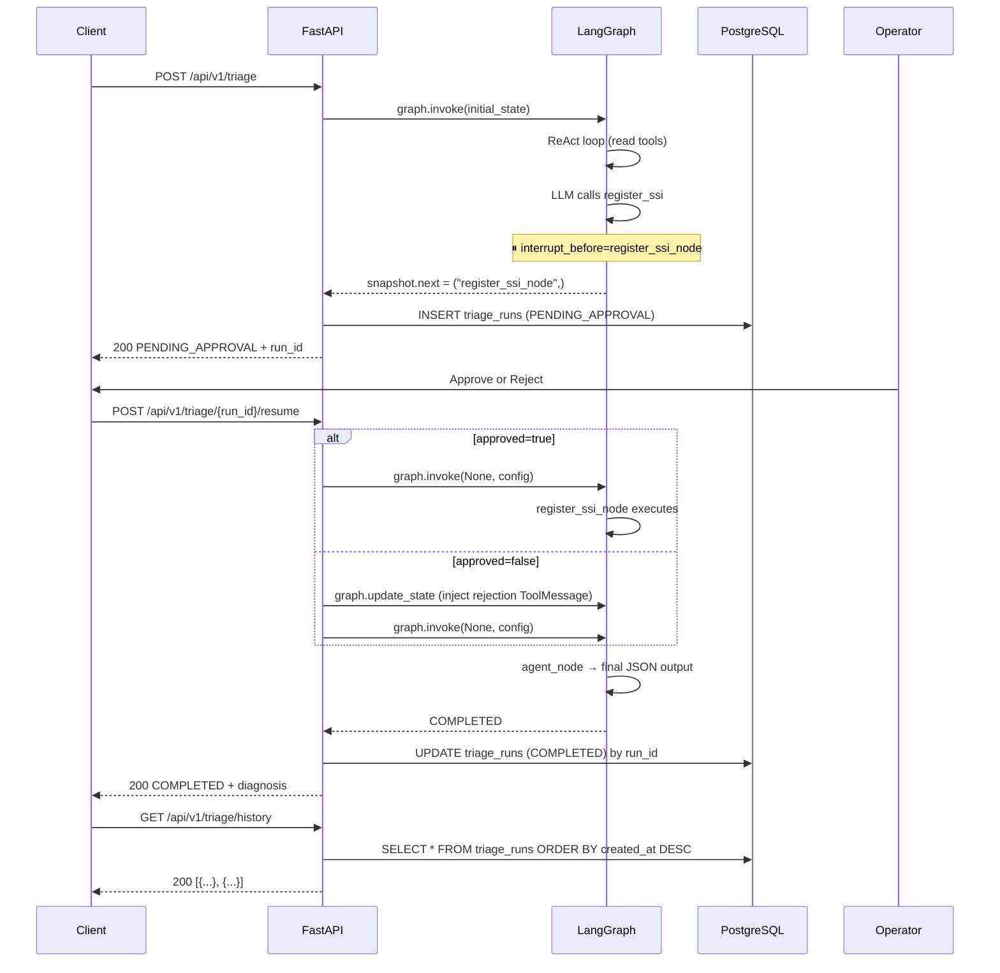
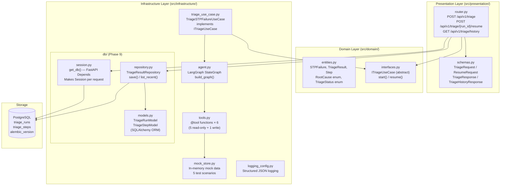
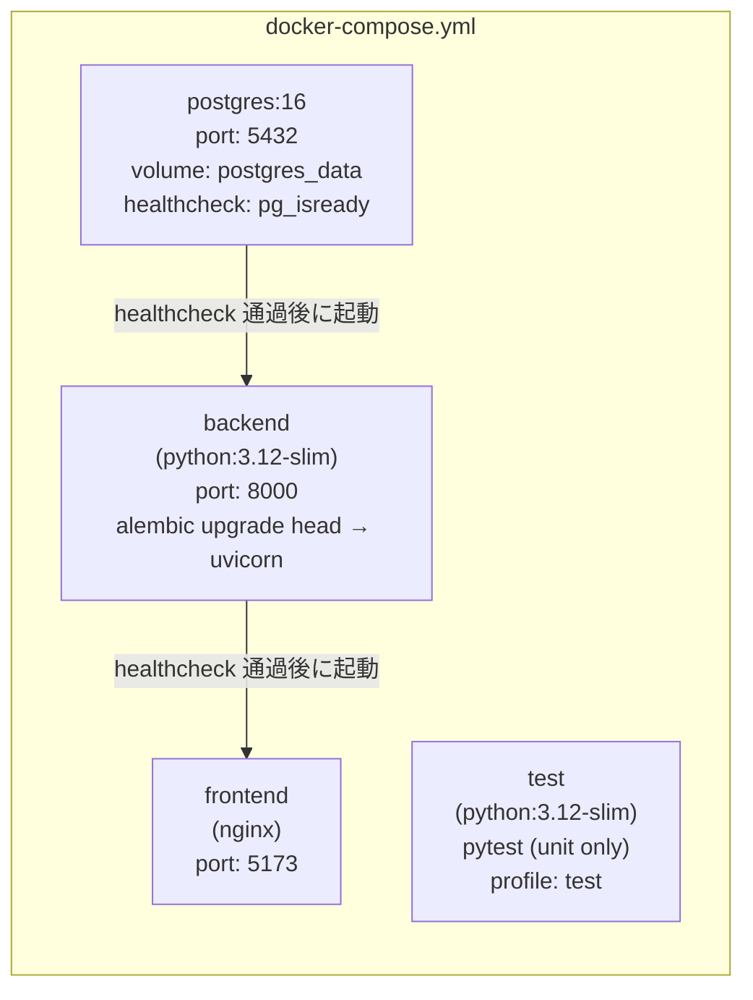
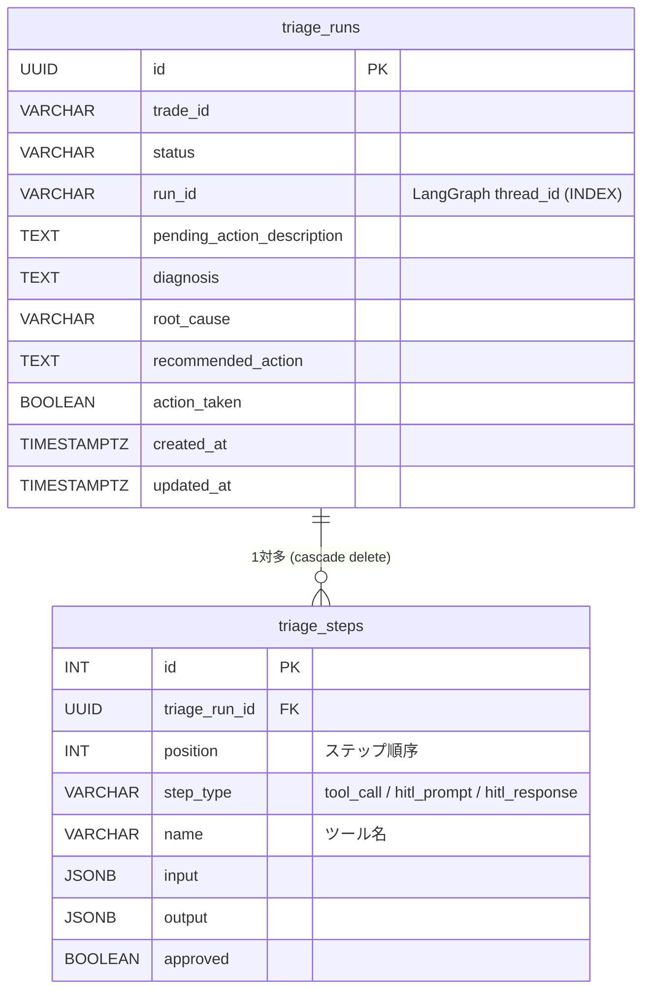

# Architecture

## LangGraph StateGraph — エージェントフロー


### HITL フロー（DB 永続化を含む）



---

## Clean Architecture — 層構成



**層のルール（と今回の実用的な例外）:**
- Infrastructure → Domain のみ参照可
- Domain はフレームワーク依存ゼロ（純粋な Python）
- Presentation は本来 Domain のみ参照すべきだが、DB 永続化（`get_db`, `TriageResultRepository`）を router で直接扱うことで実装を簡潔にしている（学習プロジェクトとしての実用的な選択）

---

## Docker Compose 構成



**各サービスの起動順序:**
1. `postgres` — healthcheck（`pg_isready`）が通るまで待機
2. `backend` — `alembic upgrade head` で migration 適用 → `uvicorn` 起動
3. `frontend` — backend の healthcheck 通過後に nginx 起動

**テストサービス（`test` profile）:**
```bash
# 通常の up には含まれない。明示的に実行する
docker compose --profile test run test
```

---

## Alembic マイグレーション

### ファイル構成

```
alembic.ini                          ← Alembic 設定（sqlalchemy.url は env.py で上書き）
alembic/
  env.py                             ← DATABASE_URL 環境変数を注入、Base.metadata を登録
  script.py.mako                     ← revision ファイルのテンプレート
  versions/
    0001_initial_schema.py           ← triage_runs + triage_steps 作成
```

### migration ライフサイクル

```
1. models.py を変更（例: カラム追加）
      ↓
2. alembic revision --autogenerate -m "add error_code"
      ↓ ← ここで .py ファイルが生成されるだけ（DB は変わらない）
   alembic/versions/0002_add_error_code.py

3. git add + git commit  ← migration ファイルをコード変更と一緒にコミット

4. alembic upgrade head  ← ここで初めて DB に ALTER TABLE が実行される
   （docker compose up 時に backend が自動実行）
```

### DB 状態追跡

Alembic は `alembic_version` テーブルで適用済み revision を追跡する：

```sql
SELECT * FROM alembic_version;
-- version_num
-- -----------
-- 0001          ← 現在このバージョンまで適用済み
```

### よく使うコマンド

| コマンド | 意味 |
|---------|------|
| `alembic upgrade head` | 未適用の migration を全て適用 |
| `alembic downgrade -1` | 直前の migration を1つ取り消し |
| `alembic revision --autogenerate -m "説明"` | モデルとDB差分から migration ファイル生成 |
| `alembic history` | migration 履歴を一覧表示 |
| `alembic current` | 現在 DB に適用済みの revision を確認 |

---

## DB スキーマ



---

## ツール一覧

| ツール名 | 種別 | 説明 |
|---------|------|------|
| `get_trade_detail` | read | トレード詳細取得 |
| `get_counterparty` | read | カウンターパーティ情報取得 |
| `get_reference_data` | read | 銘柄リファレンスデータ取得 |
| `get_settlement_instructions` | read | 登録済みSSI取得 |
| `lookup_external_ssi` | read | 外部ソースからSSI検索 |
| `register_ssi` | **write** | SSI登録（HITL必須） |

---

## API エンドポイント

| メソッド | パス | 説明 |
|---------|------|------|
| `POST` | `/api/v1/triage` | トリアージ開始。COMPLETED または PENDING_APPROVAL を返す |
| `POST` | `/api/v1/triage/{run_id}/resume` | HITL 承認/拒否後の再開 |
| `GET` | `/api/v1/triage/history` | DB に保存されたトリアージ履歴を返す（新しい順） |

---

## AgentState (LangGraph)

```python
class AgentState(TypedDict):
    messages: Annotated[list[BaseMessage], add_messages]  # メッセージ履歴
    trade_id: str        # 調査対象トレードID
    error_message: str   # STPエラーメッセージ
    action_taken: bool   # SSI登録が実行されたか
```
