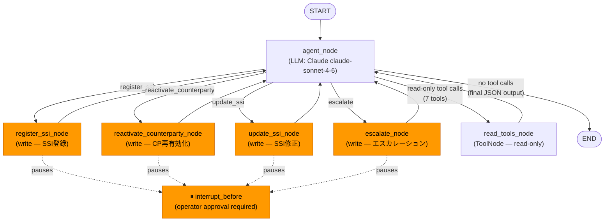
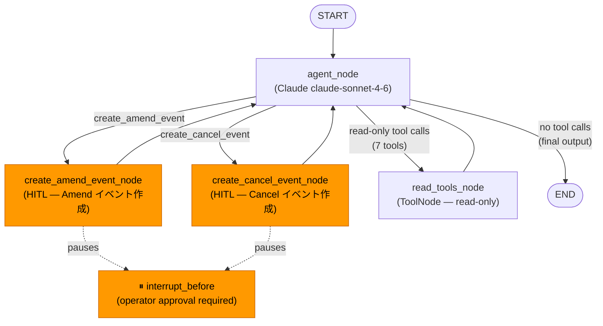
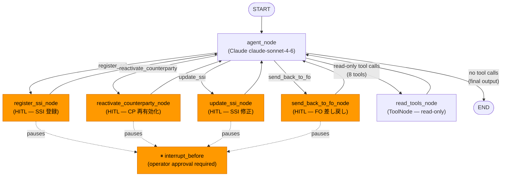
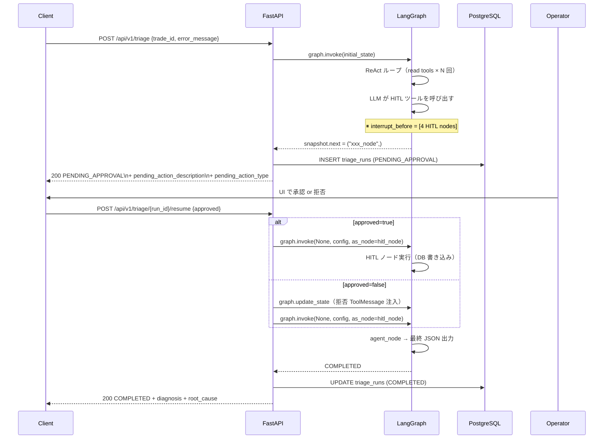
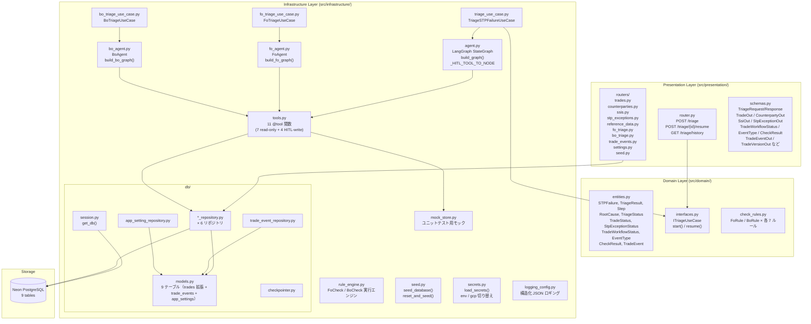
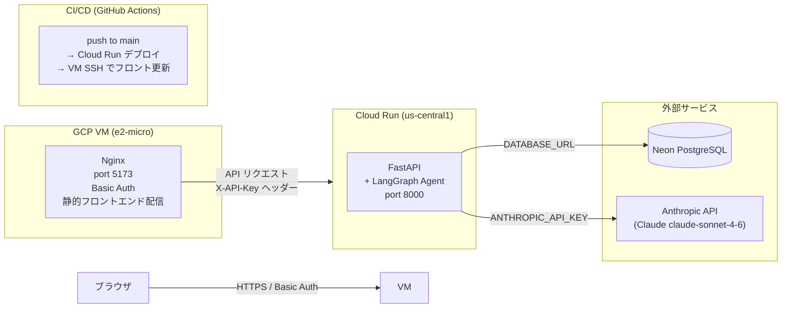
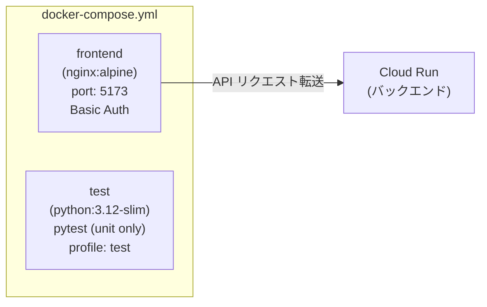
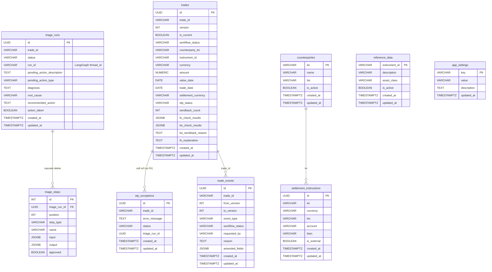

# Architecture

## LangGraph エージェント構成

| エージェント | ファイル | 役割 | HITL ノード数 |
|---|---|---|---|
| Legacy Agent | agent.py | STP 例外トリアージ（旧） | 4 |
| FoAgent | fo_agent.py | FoCheck 結果調査 / Amend・Cancel 提案 | 2 |
| BoAgent | bo_agent.py | BoCheck 結果調査 / SSI・CP 修正 / FO 差し戻し | 4 |

## LangGraph StateGraph — エージェントフロー

### Legacy Agent フロー（agent.py）

4 種の HITL ノードを汎化アーキテクチャで管理。`_HITL_TOOL_TO_NODE` dict でルーティングを制御する。



### HITL ルーティング実装

```python
# agent.py
_HITL_TOOL_TO_NODE: dict[str, str] = {
    "register_ssi":            "register_ssi_node",
    "reactivate_counterparty": "reactivate_counterparty_node",
    "update_ssi":              "update_ssi_node",
    "escalate":                "escalate_node",
}

def _route_after_agent(state: AgentState) -> str:
    tool_name = last_tool_call(state)
    if tool_name in _HITL_TOOL_TO_NODE:
        return _HITL_TOOL_TO_NODE[tool_name]   # → HITL ノード
    if tool_name:
        return "read_tools_node"
    return END
```

### FoAgent フロー（fo_agent.py）



### BoAgent フロー（bo_agent.py）



---

## HITL シーケンス（4 アクション共通）



---

## Clean Architecture — 層構成



**層のルール:**
- Infrastructure → Domain のみ参照可
- Domain はフレームワーク依存ゼロ（純粋な Python）
- Presentation は Domain インターフェース経由でユースケースを呼び出す

---

## インフラ構成（本番環境）



**アクセス制御:**
- フロントエンド: Nginx Basic Auth（`APP_USERNAME` / `APP_PASSWORD`）
- バックエンド LLM エンドポイント: `X-API-Key` ヘッダー必須（`API_KEY` 環境変数）
- `/health`, `/docs` は認証不要

---

## Docker Compose 構成（開発・CI）

バックエンドは Cloud Run で稼働するため、`docker-compose.yml` はフロントエンドとテストのみ管理する。



```bash
# フロントエンドのみ起動
docker compose up --build -d

# ユニットテスト実行
docker compose --profile test run test
```

---

## Alembic マイグレーション

```
alembic/versions/
  0001_initial_schema.py         # triage_runs + triage_steps
  0002_add_domain_tables.py      # trades / counterparties /
                                 # settlement_instructions /
                                 # reference_data / stp_exceptions
  0003_add_workflow_schema.py    # trades 拡張（UUID PK・version・workflow_status 等）
                                 # trade_events・app_settings テーブル追加
  0004_fix_focheck_initial_status.py  # FoCheck 初期ステータス修正
```

```bash
alembic upgrade head       # 未適用 migration を全て適用
alembic downgrade -1       # 直前の migration を 1 つ取り消し
alembic history            # migration 履歴一覧
alembic current            # 現在 DB に適用済みの revision
```

---

## DB スキーマ



---

## ツール一覧

### Legacy Agent ツール（agent.py）

| ツール名 | 種別 | 説明 |
|---------|------|------|
| `get_trade_detail` | read | トレード詳細取得 |
| `get_settlement_instructions` | read | 登録済み SSI 取得 |
| `get_reference_data` | read | 銘柄リファレンスデータ取得 |
| `get_counterparty` | read | カウンターパーティ情報取得 |
| `lookup_external_ssi` | read | 外部ソースから SSI 検索 |
| `get_triage_history` | read | 同一取引の過去トリアージ結果 |
| `get_counterparty_exception_history` | read | 直近 30 日の CP 別 STP 失敗件数 |
| `register_ssi` | **HITL write** | 新規 SSI 登録 |
| `update_ssi` | **HITL write** | 既存 SSI の BIC / 口座番号 / IBAN 修正 |
| `reactivate_counterparty` | **HITL write** | 非アクティブ CP を再有効化 |
| `escalate` | **HITL write** | 担当者エスカレーション |

### FoAgent ツール（fo_agent.py）

| ツール名 | 種別 | 説明 |
|---------|------|------|
| `get_trade_detail` | read | トレード詳細取得 |
| `get_reference_data` | read | 銘柄リファレンスデータ取得 |
| `get_counterparty` | read | カウンターパーティ情報取得 |
| `get_fo_check_results` | read | FoCheck ルール結果取得 |
| `get_bo_sendback_reason` | read | BoAgent からの差し戻し理由取得 |
| `get_triage_history` | read | 同一取引の過去トリアージ結果 |
| `get_counterparty_exception_history` | read | 直近 30 日の CP 別 STP 失敗件数 |
| `create_amend_event` | **HITL write** | Amend イベント作成 |
| `create_cancel_event` | **HITL write** | Cancel イベント作成 |
| `provide_explanation` | write | 説明付きで FoValidated に遷移 |
| `escalate_to_fo_user` | write | FoUserToValidate に遷移 |

### BoAgent ツール（bo_agent.py）

| ツール名 | 種別 | 説明 |
|---------|------|------|
| `get_trade_detail` | read | トレード詳細取得 |
| `get_counterparty` | read | カウンターパーティ情報取得 |
| `get_settlement_instructions` | read | 登録済み SSI 取得 |
| `lookup_external_ssi` | read | 外部ソースから SSI 検索 |
| `get_triage_history` | read | 同一取引の過去トリアージ結果 |
| `get_counterparty_exception_history` | read | 直近 30 日の CP 別 STP 失敗件数 |
| `get_bo_check_results` | read | BoCheck ルール結果取得 |
| `get_fo_explanation` | read | FoAgent の説明取得（2 回目トリアージ時） |
| `register_ssi` | **HITL write** | 新規 SSI 登録 |
| `update_ssi` | **HITL write** | 既存 SSI の BIC / 口座番号 / IBAN 修正 |
| `reactivate_counterparty` | **HITL write** | 非アクティブ CP を再有効化 |
| `send_back_to_fo` | **HITL write** | FoAgent に差し戻し（1 回目のみ） |
| `escalate_to_bo_user` | write | BoUserToValidate に遷移 |

---

## AgentState（LangGraph）

```python
class AgentState(TypedDict):
    messages: Annotated[list[BaseMessage], add_messages]
    trade_id: str        # 調査対象トレード ID
    error_message: str   # STP エラーメッセージ
    action_taken: bool   # HITL アクションが実行されたか
```

```python
class FoAgentState(TypedDict):
    messages: Annotated[list[BaseMessage], add_messages]
    trade_id: str        # 調査対象トレード ID
    error_message: str   # FoCheck 失敗メッセージ
    action_taken: bool   # HITL アクションが実行されたか

class BoAgentState(TypedDict):
    messages: Annotated[list[BaseMessage], add_messages]
    trade_id: str        # 調査対象トレード ID
    error_message: str   # BoCheck 失敗メッセージ
    action_taken: bool   # HITL アクションが実行されたか
```

---

## フロントエンド画面一覧

| 画面 | パス | 説明 |
|------|------|------|
| TriagePage | `/` | トリアージ実行・HITL 承認 UI |
| TriageHistoryPage | `/history` | トリアージ履歴（展開でフル診断表示） |
| TradeListPage | `/trades` | 取引一覧・フィルタ |
| TradeInputPage | `/trades/new` | 取引入力フォーム（新規作成） |
| TradeDetailPage | `/trades/:trade_id` | 取引詳細（4 タブ: FoCheck / BoCheck / Events / Triage） |
| StpExceptionListPage | `/stp-exceptions` | STP 例外一覧・トリアージ起動 |
| StpExceptionCreatePage | `/stp-exceptions/new` | STP 例外手動登録 |
| CounterpartyListPage | `/counterparties` | CP 一覧・フィルタ |
| CounterpartyEditPage | `/counterparties/:lei` | CP 編集（name/BIC/is_active） |
| SsiListPage | `/ssis` | SSI 一覧（内部/外部フィルタ） |
| SsiEditPage | `/ssis/:id` | 内部 SSI 編集（BIC/account/IBAN） |
| ReferenceDataListPage | `/reference-data` | 銘柄マスタ一覧（参照のみ） |
| SettingsPage | `/settings` | FoCheck / BoCheck トリガー設定（auto / manual） |
