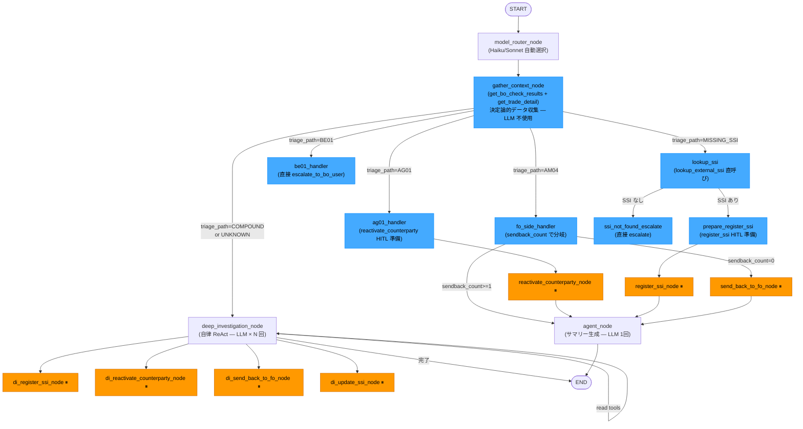
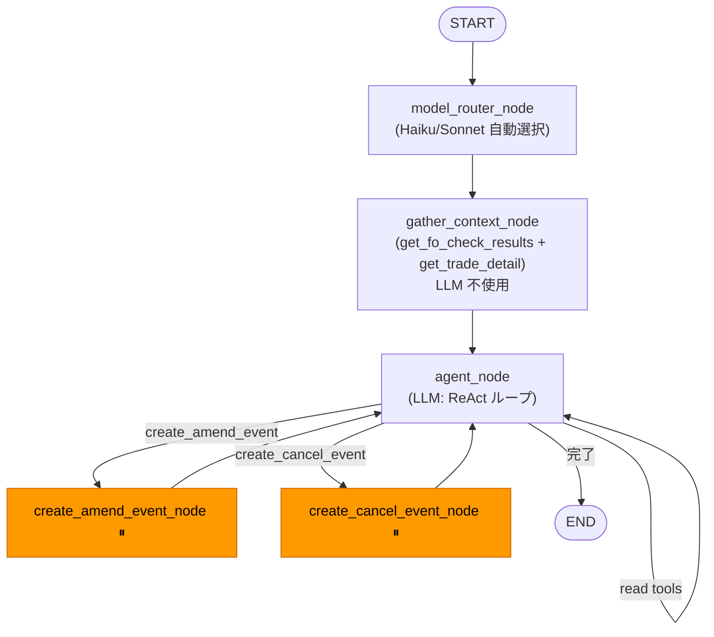
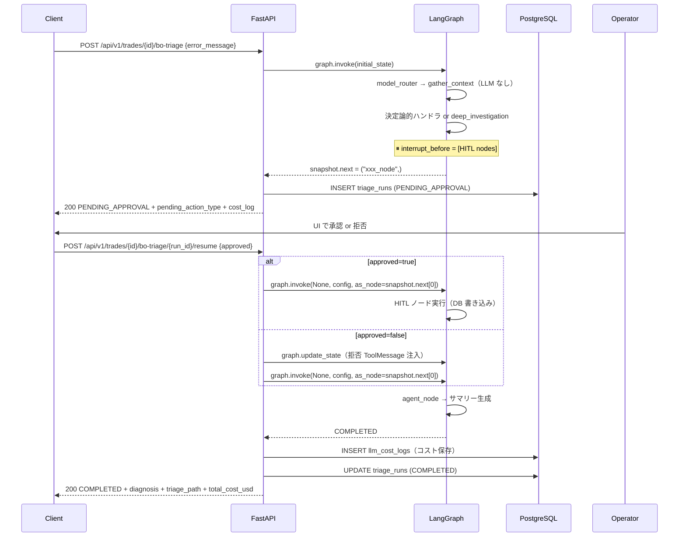
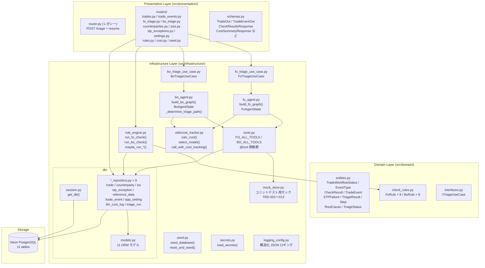
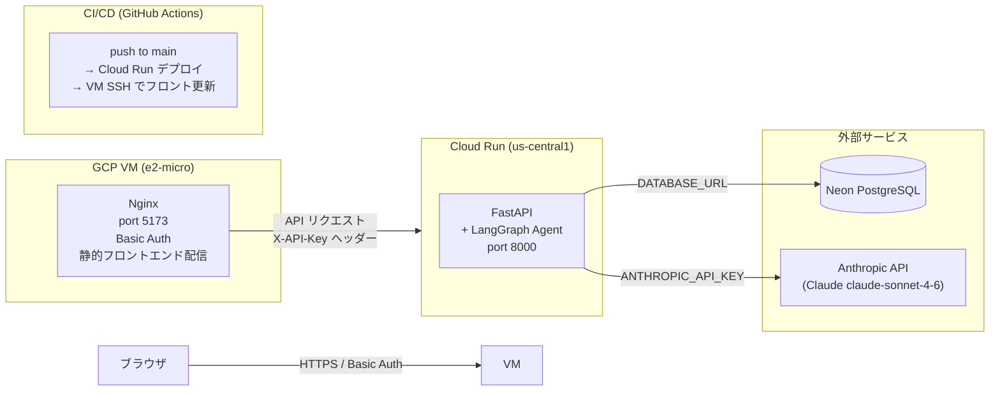
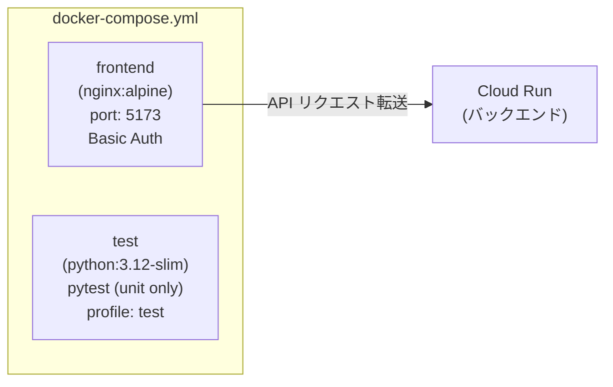
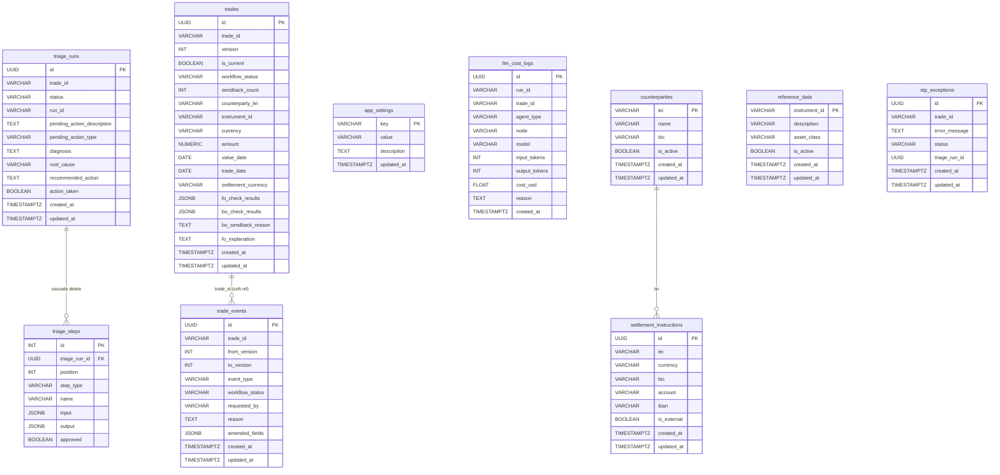

# Architecture

## LangGraph StateGraph — エージェントフロー

FoAgent と BoAgent はそれぞれ独立した LangGraph StateGraph を持つ。
BoAgent はハイブリッド構造（決定論的パス + 自律 ReAct パス）を採用している。

### BoAgent フロー（`src/infrastructure/bo_agent.py`）



### FoAgent フロー（`src/infrastructure/fo_agent.py`）



### 決定論的パス vs 自律パスのコスト比較

| エラー種別 | パス | LLM 呼び出し | コスト目安 |
|-----------|------|-------------|---------|
| AG01 / counterparty_inactive | 決定論的 | summary 1 回 | ~$0.002 |
| MISSING_SSI (外部 SSI あり) | 決定論的 | summary 1 回 | ~$0.002 |
| MISSING_SSI (外部 SSI なし) | 決定論的 | summary 1 回 | ~$0.002 |
| BE01 / format error | 決定論的 | summary 1 回 | ~$0.002 |
| AM04 (sendback=0) | 決定論的 | summary 1 回 | ~$0.002 |
| AM04 (sendback≥1) | 決定論的 | summary 1 回 | ~$0.002 |
| UNKNOWN / COMPOUND | 自律（ReAct） | 2 回以上 | ~$0.01〜0.05 |

---

## HITL シーケンス（FO/BO トリアージ共通）



---

## Clean Architecture — 層構成



**層のルール:**
- Infrastructure → Domain のみ参照可
- Domain はフレームワーク依存ゼロ（純粋な Python）
- Presentation → Infrastructure はユースケース経由のみ

---

## インフラ構成（本番環境）



**アクセス制御:**
- フロントエンド: Nginx Basic Auth（`APP_USERNAME` / `APP_PASSWORD`）
- バックエンド LLM エンドポイント: `X-API-Key` ヘッダー必須（`API_KEY` 環境変数）
- `/health`, `/docs` は認証不要

---

## Docker Compose 構成（開発・CI）

バックエンドは Cloud Run で稼働するため、`docker-compose.yml` はフロントエンドとテストのみ管理する。



```bash
# フロントエンドのみ起動
docker compose up --build -d

# ユニットテスト実行
docker compose --profile test run test
```

---

## Alembic マイグレーション

```
alembic/versions/
  0001_initial_schema.py          # triage_runs + triage_steps
  0002_add_domain_tables.py       # trades / counterparties / settlement_instructions
                                  # reference_data / stp_exceptions
  0003_add_workflow_schema.py     # trades に uuid id / version / workflow_status /
                                  # is_current / fo_check_results / bo_check_results 等追加
                                  # trade_events / app_settings テーブル追加
  0004_fix_focheck_initial_status.py  # データ修正 migration（FoAgentToCheck→FoCheck）
  0005_drop_stp_status.py         # trades.stp_status カラム削除
  0006_add_llm_cost_log.py        # llm_cost_logs テーブル追加
```

```bash
alembic upgrade head       # 未適用 migration を全て適用
alembic downgrade -1       # 直前の migration を 1 つ取り消し
alembic history            # migration 履歴一覧
alembic current            # 現在 DB に適用済みの revision
```

---

## DB スキーマ



---

## ツール一覧

### FO エージェント用ツール（`FO_ALL_TOOLS`）

| ツール名 | 種別 | 説明 |
|---------|------|------|
| `get_trade_detail` | read | 取引詳細取得 |
| `get_reference_data` | read | 銘柄マスタ参照 |
| `get_counterparty` | read | 取引先情報参照 |
| `get_settlement_instructions` | read | 登録済み SSI 取得 |
| `get_triage_history` | read | 過去トリアージ履歴 |
| `get_counterparty_exception_history` | read | 直近 30 日 CP 別失敗件数 |
| `get_fo_check_results` | read | FoCheck ルール結果取得 |
| `get_bo_sendback_reason` | read | BoAgent 差し戻し理由取得 |
| `create_amend_event` | **HITL write** | Amend イベント作成 |
| `create_cancel_event` | **HITL write** | Cancel イベント作成 |
| `provide_explanation` | write | 説明付き FoValidated 遷移 |
| `escalate_to_fo_user` | write | FoUserToValidate 遷移 |

### BO エージェント用ツール（`BO_ALL_TOOLS`）

| ツール名 | 種別 | 説明 |
|---------|------|------|
| `get_trade_detail` | read | 取引詳細取得 |
| `get_counterparty` | read | 取引先情報参照 |
| `get_settlement_instructions` | read | 登録済み SSI 取得 |
| `lookup_external_ssi` | read | 外部ソース SSI 検索 |
| `get_triage_history` | read | 過去トリアージ履歴 |
| `get_counterparty_exception_history` | read | 直近 30 日 CP 別失敗件数 |
| `get_bo_check_results` | read | BoCheck ルール結果取得 |
| `get_fo_explanation` | read | FoAgent 説明取得（2 回目トリアージ時） |
| `register_ssi` | **HITL write** | 新規 SSI 登録 |
| `update_ssi` | **HITL write** | 既存 SSI 修正（BIC/口座/IBAN） |
| `reactivate_counterparty` | **HITL write** | 非アクティブ CP 再有効化 |
| `send_back_to_fo` | **HITL write** | FoAgent 差し戻し（1 回目のみ） |
| `escalate_to_bo_user` | write | BoUserToValidate 遷移 |

---

## AgentState（LangGraph）

```python
class FoAgentState(TypedDict):
    messages: Annotated[list[BaseMessage], add_messages]
    trade_id: str
    error_message: str
    action_taken: bool
    triage_path: str          # 診断パス種別
    sendback_count: int       # BoAgent からの差し戻し回数
    failed_rules: list[str]
    cost_log: Annotated[list[dict], operator.add]
    total_cost_usd: Annotated[float, operator.add]
    task_type: str            # "simple" / "complex" / "critical"
    selected_model: str       # 実際に使用したモデル ID

class BoAgentState(TypedDict):
    messages: Annotated[list[BaseMessage], add_messages]
    trade_id: str
    error_message: str
    action_taken: bool
    triage_path: str          # AG01 / MISSING_SSI / BE01 / AM04 / COMPOUND / UNKNOWN
    sendback_count: int
    failed_rules: list[str]
    counterparty_lei: str
    currency: str
    cost_log: Annotated[list[dict], operator.add]
    total_cost_usd: Annotated[float, operator.add]
    task_type: str
    selected_model: str
```

---

## フロントエンド画面一覧

| 画面 | パス | 説明 |
|------|------|------|
| TriagePage | `/` | レガシートリアージ UI（旧 agent.py 使用） |
| TradeListPage | `/trades` | 取引一覧・workflow_status フィルタ |
| TradeInputPage | `/trades/new` | 新規取引入力フォーム |
| TradeDetailPage | `/trades/:id` | 取引詳細（FoCheck/BoCheck/Events/Triage タブ） |
| StpExceptionListPage | `/stp-exceptions` | STP 例外一覧・ルール違反モーダル |
| CounterpartyListPage | `/counterparties` | CP 一覧・フィルタ |
| CounterpartyEditPage | `/counterparties/:lei` | CP 編集（name/BIC/is_active） |
| SettingsPage | `/settings` | FoCheck/BoCheck トリガー設定（auto/manual） |
| RuleListPage | `/rules` | FO/BO ルール一覧（severity バッジ・stub フラグ） |
| CostPage | `/cost` | LLM コストダッシュボード（サマリー/エージェント別/日次） |
