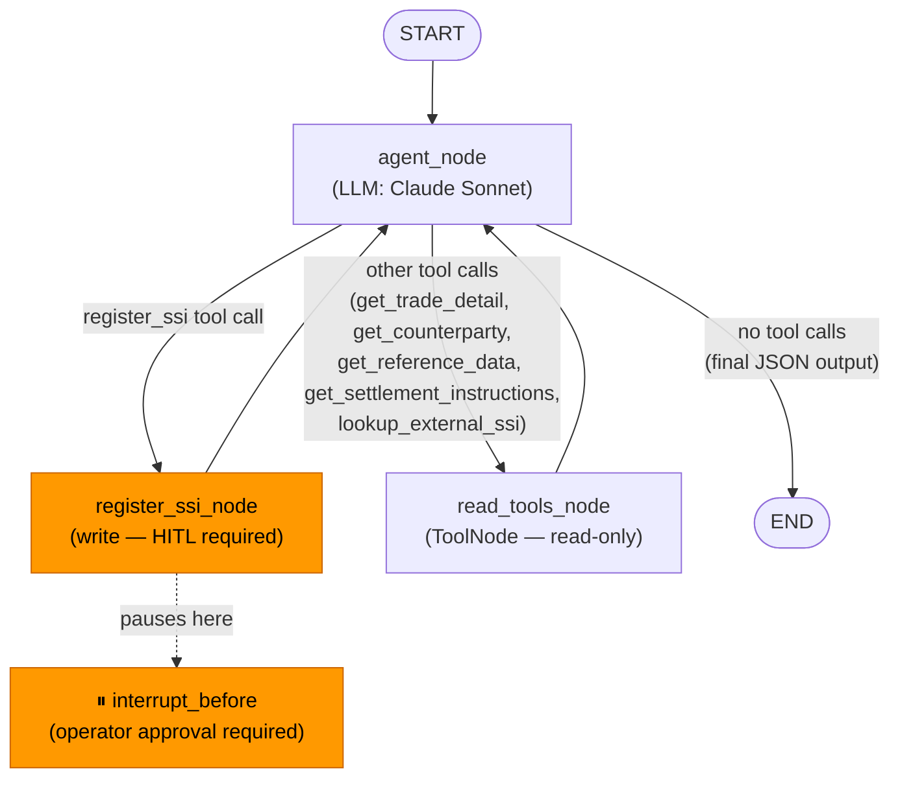
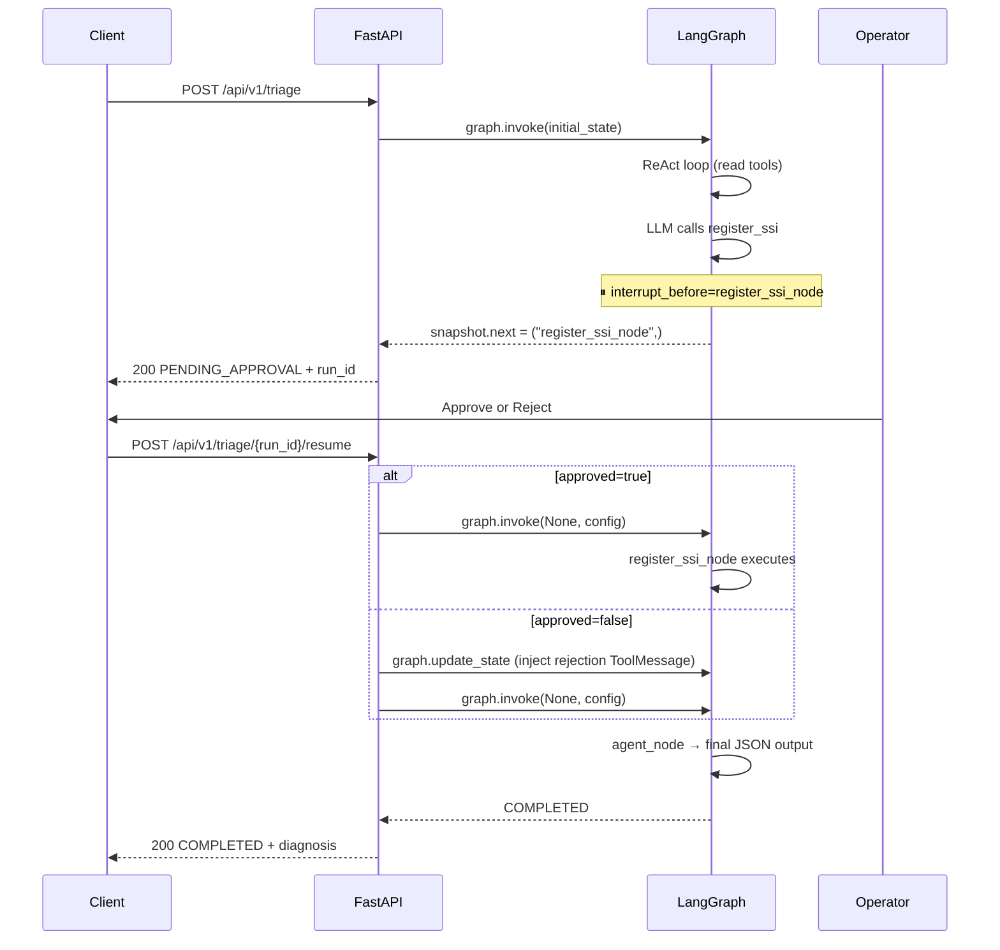
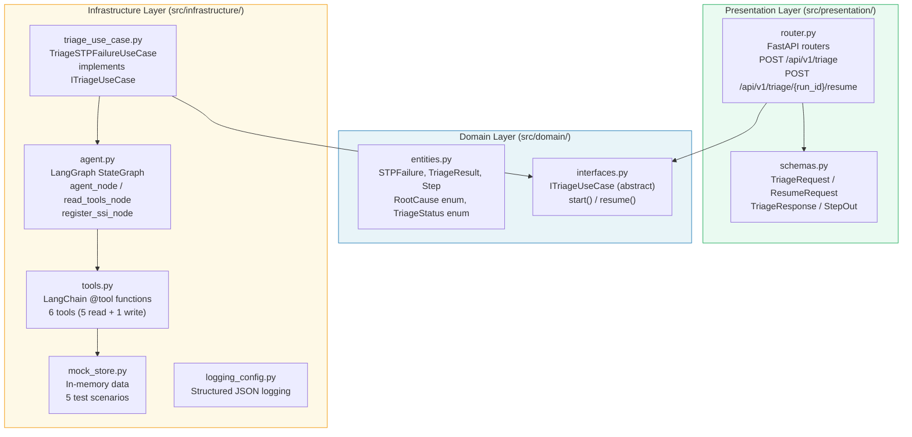

# Architecture

## LangGraph StateGraph — エージェントフロー



### HITLフロー



---

## Clean Architecture — 層構成



**層のルール:**
- Presentation → Domain のみ参照可（Infrastructureを直接参照しない）
- Infrastructure → Domain のみ参照可
- Domain はフレームワーク依存ゼロ（純粋なPython）

---

## ツール一覧

| ツール名 | 種別 | 説明 |
|---------|------|------|
| `get_trade_detail` | read | トレード詳細取得 |
| `get_counterparty` | read | カウンターパーティ情報取得 |
| `get_reference_data` | read | 銘柄リファレンスデータ取得 |
| `get_settlement_instructions` | read | 登録済みSSI取得 |
| `lookup_external_ssi` | read | 外部ソースからSSI検索 |
| `register_ssi` | **write** | SSI登録（HITL必須） |

---

## AgentState (LangGraph)

```python
class AgentState(TypedDict):
    messages: Annotated[list[BaseMessage], add_messages]  # メッセージ履歴
    trade_id: str        # 調査対象トレードID
    error_message: str   # STPエラーメッセージ
    action_taken: bool   # SSI登録が実行されたか
```
