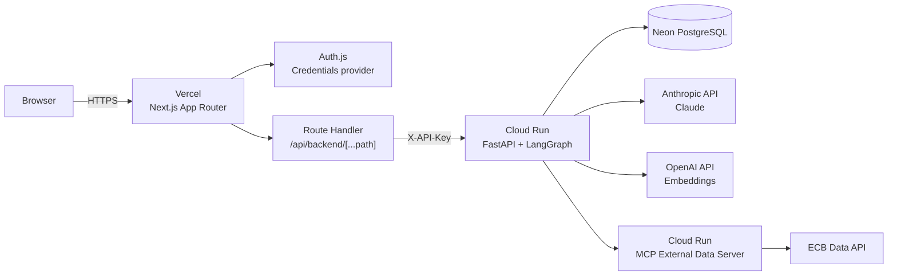
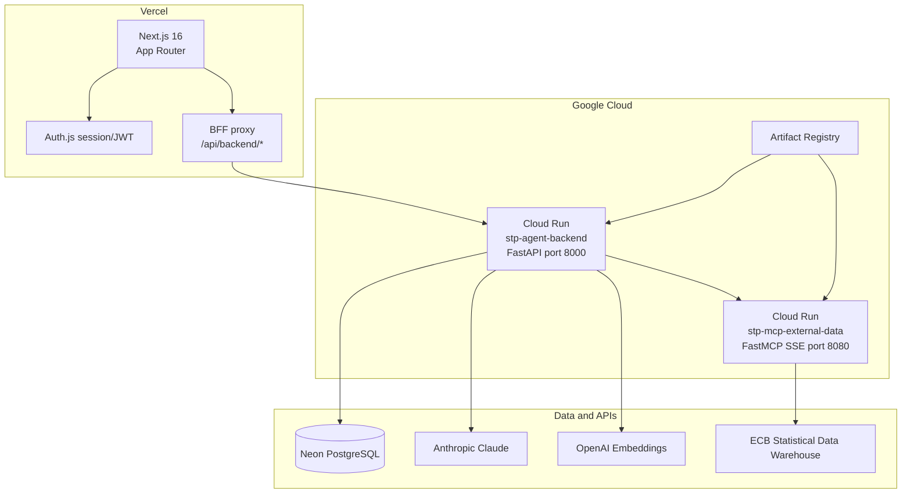
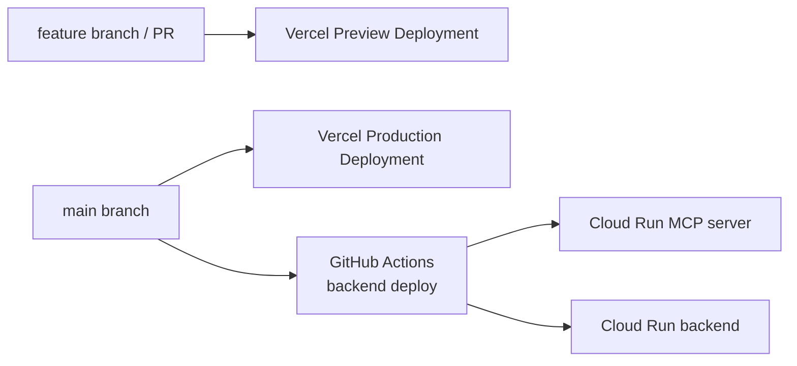
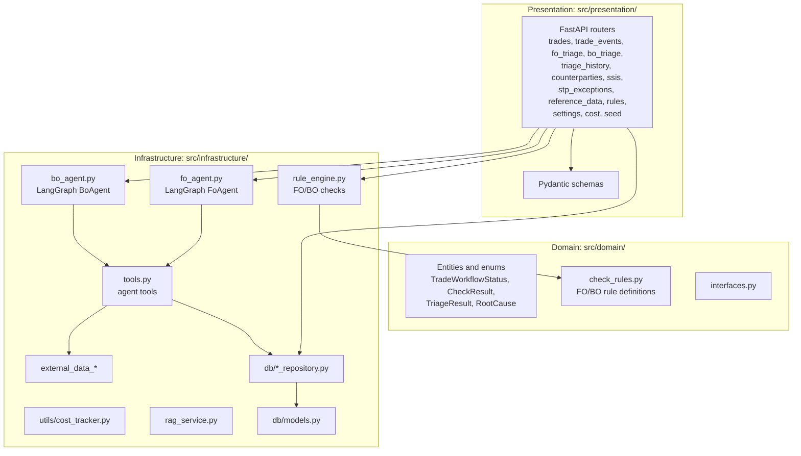
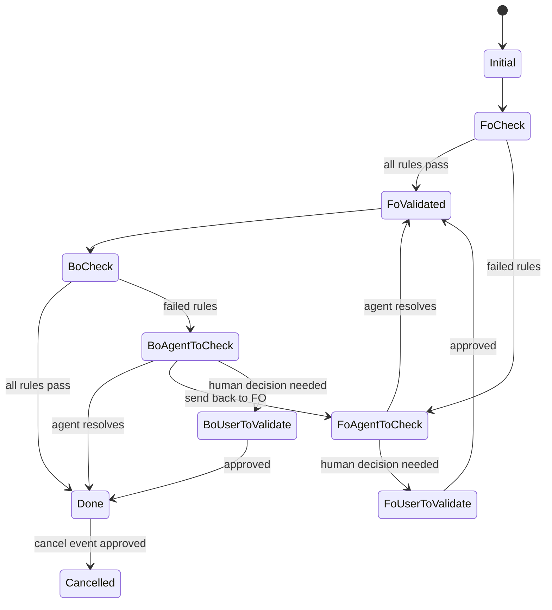
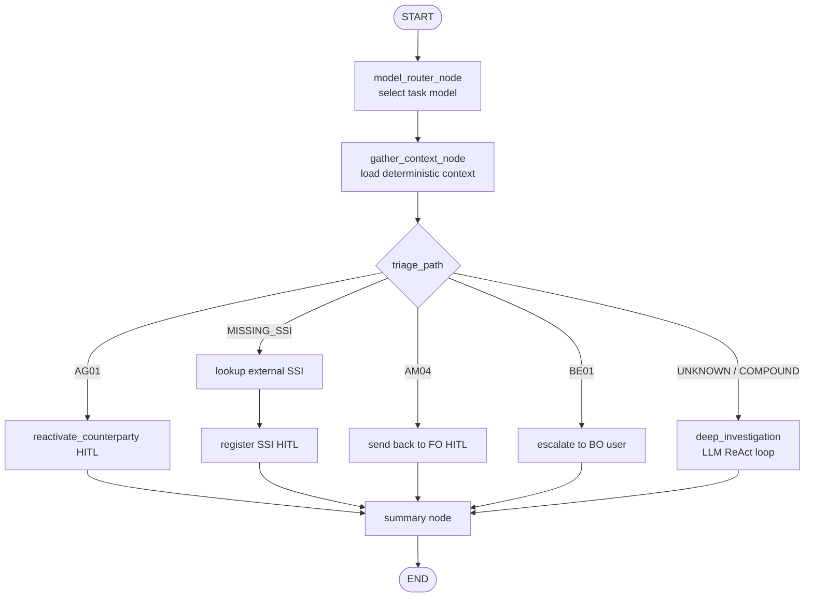

# Architecture

This document is the canonical English architecture reference for the STP
Exception Triage Agent.

## System Overview

The application is split into a Next.js frontend/BFF and a FastAPI backend.
The frontend is hosted on Vercel. The backend and the external-data MCP server
run on Cloud Run. The browser never calls Cloud Run directly in normal use;
it calls the Next.js BFF, which forwards requests to FastAPI with the backend
API key.



## Deployment Topology



## CI/CD



- Frontend deployments are managed by Vercel Git Integration with `frontend`
  as the project root directory.
- Pull requests create Vercel Preview Deployments.
- Merges to `main` create a Vercel Production Deployment.
- GitHub Actions deploy only backend-related services to Cloud Run.
- The old static frontend deployment path is retired.

## Frontend Architecture

The frontend uses Next.js App Router.

| Area | Location | Responsibility |
| --- | --- | --- |
| Root layout | `frontend/src/app/layout.tsx` | Metadata, global font setup, global CSS |
| Protected layout | `frontend/src/app/(protected)/layout.tsx` | Auth guard for business screens |
| Pages | `frontend/src/app/(protected)/**/page.tsx` | Thin route entries that render screens |
| Login | `frontend/src/app/login/page.tsx` | Auth.js credentials sign-in |
| Auth route | `frontend/src/app/api/auth/[...nextauth]/route.ts` | Auth.js HTTP handlers |
| BFF route | `frontend/src/app/api/backend/[...path]/route.ts` | Authenticated FastAPI proxy |
| Middleware | `frontend/src/middleware.ts` | IP-based rate limiting on login endpoint |
| Auth config | `frontend/src/auth.ts` | Auth.js provider, bcrypt verify, account lockout |
| Account lockout | `frontend/src/account-lockout.ts` | Per-username failure counter backed by Upstash Redis |
| Screens | `frontend/src/screens/` | Migrated client UI screens |
| API client | `frontend/src/api/` | Browser calls to `/api/backend/*` |

Routes:

| Route | Screen |
| --- | --- |
| `/` | Home |
| `/history` | Triage history |
| `/trades` | Trade list |
| `/trades/new` | Trade creation |
| `/trades/[tradeId]` | Trade detail |
| `/stp-exceptions` | STP exception list |
| `/stp-exceptions/new` | STP exception creation |
| `/counterparties` | Counterparty list |
| `/counterparties/[lei]` | Counterparty edit |
| `/ssis` | SSI list |
| `/ssis/[id]` | SSI edit |
| `/reference-data` | Reference data list |
| `/rules` | Rule list |
| `/cost` | LLM cost dashboard |
| `/settings` | System settings |

## Authentication and BFF

Auth.js uses a Credentials provider with one administrator account.
The login flow passes through two independent security layers before the
session is issued.

```
Browser POST /api/auth/callback/credentials
    │
    ▼
[middleware.ts] ── IP rate limit (5 req / 10 min / IP, Upstash Redis)
    │ 429 → reject immediately
    ▼
[auth.ts authorize()]
    ├─ Account lockout check (5 failures → 15 min lock, Upstash Redis)
    │      locked → return null
    ├─ bcrypt.compare() — always runs to prevent timing-based enumeration
    │      mismatch → recordFailure() → return null
    └─ match → recordSuccess() (reset counter) → issue JWT session
```

| Variable | Used by | Purpose |
| --- | --- | --- |
| `AUTH_SECRET` | Auth.js | Signs/encrypts and verifies session/JWT data |
| `APP_USERNAME` | Auth.js credentials provider | Expected login username |
| `APP_PASSWORD_HASH` | Auth.js credentials provider | bcrypt hash of the expected password |
| `UPSTASH_REDIS_REST_URL` | middleware, account-lockout | Upstash Redis endpoint for rate limiting and lockout |
| `UPSTASH_REDIS_REST_TOKEN` | middleware, account-lockout | Upstash Redis auth token |
| `BACKEND_API_URL` | Next.js BFF | FastAPI base URL |
| `BACKEND_API_KEY` | Next.js BFF | Value forwarded as `X-API-Key` |

`AUTH_SECRET` is not sent to FastAPI. It protects Auth.js session material on
the Next.js side only.

Both the rate limiter and the lockout module fail open: if the Upstash
environment variables are absent the application behaves as if no limit is
configured. This keeps local development and CI environments unaffected.

## Backend Architecture

The backend follows a pragmatic clean architecture split.



Layer rules:

- Domain should remain framework-light and contain business concepts.
- Presentation owns HTTP request/response contracts.
- Infrastructure owns LangGraph agents, database access, external services, and
  implementation details.

## FO/BO Triage Flow



## LangGraph Agent Pattern



Deterministic paths keep common cases cheap and predictable. The autonomous
ReAct path remains available for compound or unknown failures.

## Database

Core tables:

- `trades`
- `trade_events`
- `counterparties`
- `settlement_instructions`
- `reference_data`
- `stp_exceptions`
- `triage_runs`
- `triage_steps`
- `app_settings`
- `llm_cost_logs`
- `rag_chunks`

Alembic owns schema migrations under `alembic/versions`.

## Environment Variables

### Vercel

- `BACKEND_API_URL`
- `BACKEND_API_KEY`
- `AUTH_SECRET`
- `APP_USERNAME`
- `APP_PASSWORD_HASH`
- `UPSTASH_REDIS_REST_URL` — required for IP rate limiting and account lockout
- `UPSTASH_REDIS_REST_TOKEN` — required for IP rate limiting and account lockout
- `NEXT_PUBLIC_VERCEL_GIT_COMMIT_SHA` is provided by Vercel and may be shown in
  the UI as a short commit identifier.

### Cloud Run backend

- `ANTHROPIC_API_KEY`
- `OPENAI_API_KEY`
- `DATABASE_URL`
- `API_KEY`
- `CORS_ORIGINS`
- `MCP_EXTERNAL_DATA_URL`

### MCP external-data server

- `PORT`
- Optional service-specific variables for external data behavior.

## Versioning

- `frontend/package.json` contains the display version.
- `frontend/src/version.ts` combines the package version concept with the
  Vercel commit SHA display.
- Production releases should be tracked with Git tags and GitHub Releases.
