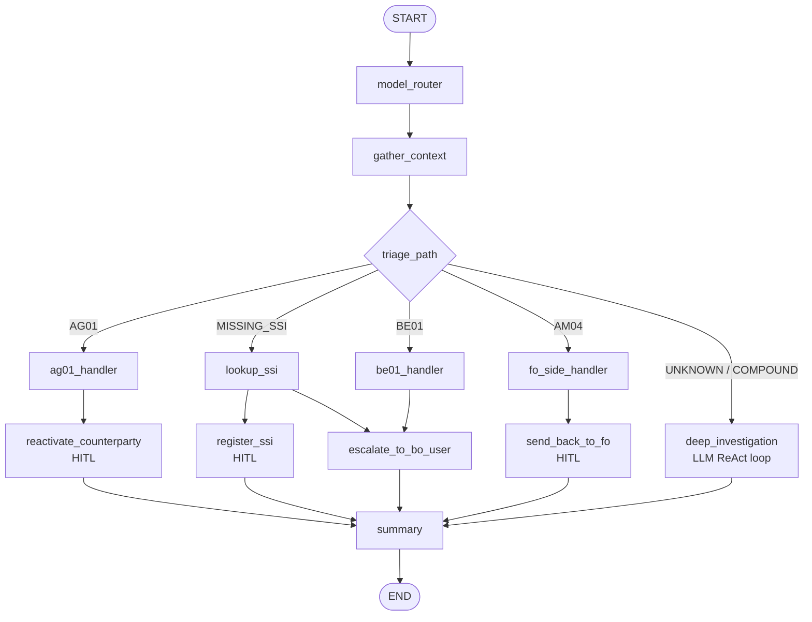

# Demo: Hybrid BoAgent - Deterministic and Autonomous Routing

This runbook walks through representative test scenarios for the hybrid
BoAgent.

## Architecture Summary



## Cost Comparison

| Path | LLM calls | Estimated cost per triage |
| --- | --- | --- |
| Deterministic (`AG01`, `MISSING_SSI`, `BE01`, `AM04`) | Usually one summary call after routing/HITL | About `$0.002` |
| Autonomous (`UNKNOWN`, `COMPOUND`) | Multiple ReAct loop calls | About `$0.01` to `$0.05` |

## Prerequisites

```bash
alembic upgrade head
python -m src.infrastructure.seed
uvicorn src.main:app --reload
```

If the frontend is needed:

```bash
cd frontend
npm run dev
```

## Scenario 1 - AG01: Counterparty Inactive

Trade: `TRD-009`

Expected path: `AG01` -> `reactivate_counterparty` HITL pause.

```bash
curl -X POST http://localhost:8000/api/v1/trades/TRD-009/bo-triage \
  -H "Content-Type: application/json" \
  -d '{"task_type": "simple"}'
```

Resume after approval:

```bash
RUN_ID="<run_id>"
curl -X POST http://localhost:8000/api/v1/trades/TRD-009/bo-triage/$RUN_ID/resume \
  -H "Content-Type: application/json" \
  -d '{"approved": true}'
```

## Scenario 2 - MISSING_SSI With External SSI Found

Trade: `TRD-001`

Expected path: `MISSING_SSI` -> external lookup -> `register_ssi` HITL pause.

```bash
curl -X POST http://localhost:8000/api/v1/trades/TRD-001/bo-triage \
  -H "Content-Type: application/json" \
  -d '{"task_type": "simple"}'
```

## Scenario 3 - MISSING_SSI Without External SSI

Trade: `TRD-008`

Expected path: `MISSING_SSI` -> no external SSI -> escalation.

```bash
curl -X POST http://localhost:8000/api/v1/trades/TRD-008/bo-triage \
  -H "Content-Type: application/json" \
  -d '{"task_type": "simple"}'
```

## Scenario 4 - BE01: IBAN Format Error

Trade: `TRD-011`

Expected path: `BE01` -> escalation.

```bash
curl -X POST http://localhost:8000/api/v1/trades/TRD-011/bo-triage \
  -H "Content-Type: application/json" \
  -d '{"task_type": "simple"}'
```

## Scenario 5 - AM04 Sendback

Trade: `TRD-013`

Expected path: `AM04` -> `send_back_to_fo` HITL pause when sendback count is
zero.

```bash
curl -X POST http://localhost:8000/api/v1/trades/TRD-013/bo-triage \
  -H "Content-Type: application/json" \
  -d '{"task_type": "simple"}'
```

## Scenario 6 - COMPOUND Failure

Trade: `TRD-010`

Expected path: `COMPOUND` -> autonomous ReAct investigation.

```bash
curl -X POST http://localhost:8000/api/v1/trades/TRD-010/bo-triage \
  -H "Content-Type: application/json" \
  -d '{"task_type": "complex"}'
```

## Scenario 7 - UNKNOWN Failure

Trade: `TRD-012`

Expected path: `UNKNOWN` -> autonomous ReAct investigation.

```bash
curl -X POST http://localhost:8000/api/v1/trades/TRD-012/bo-triage \
  -H "Content-Type: application/json" \
  -d '{"task_type": "complex"}'
```

## Running Focused Tests

```bash
uv run pytest tests/unit/test_determine_triage_path.py -v
uv run pytest tests/unit/test_gather_context_routing.py -v
uv run pytest tests/integration/test_hybrid_routing.py -m integration -v
```
