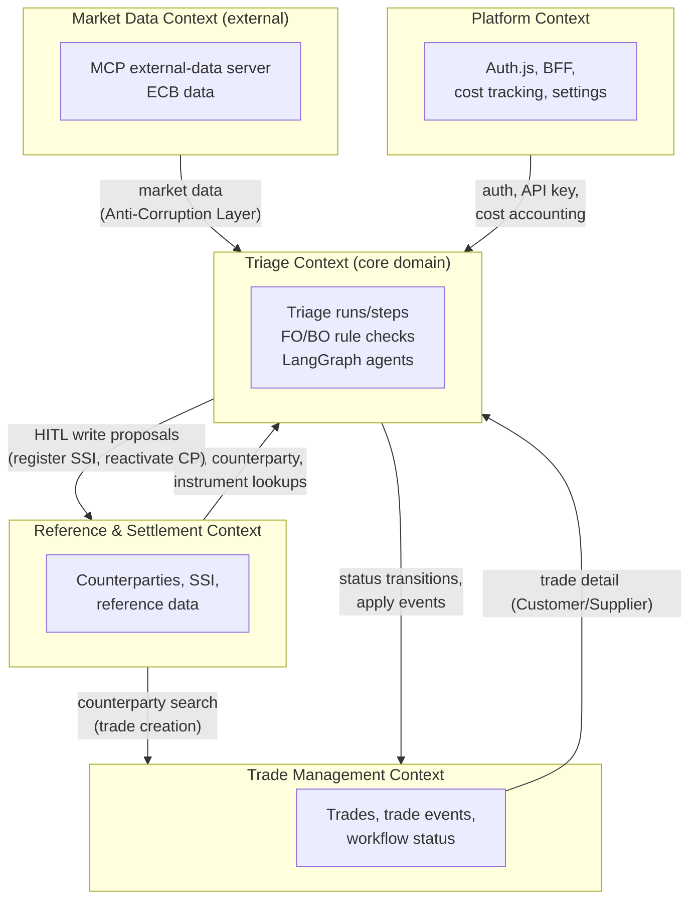

# Context Map

Bounded contexts in the system and the relationships between them. Terms are
defined in `docs/domain/glossary.md`. This complements the technical view in
`docs/architecture.md` with a domain-boundary view.

## Bounded contexts

## Relationship types

| Upstream → Downstream | Pattern | Notes |
| --- | --- | --- |
| Trade Management → Triage | Customer/Supplier | Triage consumes trade detail and writes back status transitions. |
| Reference & Settlement → Trade Management | Customer/Supplier | Trade creation reads counterparties via Counterparty Search to bind an LEI to a new trade. |
| Reference & Settlement → Triage | Customer/Supplier | Triage reads SSI/counterparty/instrument; proposes HITL writes back. |
| Market Data → Triage | Anti-Corruption Layer | The MCP external-data server isolates ECB/market-data shapes from the domain; fallback must stay testable without network. |
| Platform → all | Shared Kernel (infra) | Auth, BFF, cost tracking, and settings are cross-cutting. |

## Boundary rules for agents

- The **Triage Context is the core domain** — invest the most design and review
  effort here.
- Cross-context calls to market data go through the **MCP server with an
  Anti-Corruption Layer**; never let external data shapes leak into
  `src/domain/`.
- HITL is the boundary control for any write from Triage into Trade Management
  or Reference & Settlement.
- Browser code crosses the Platform boundary only via `/api/backend/*` (the
  BFF), never directly to Cloud Run.
