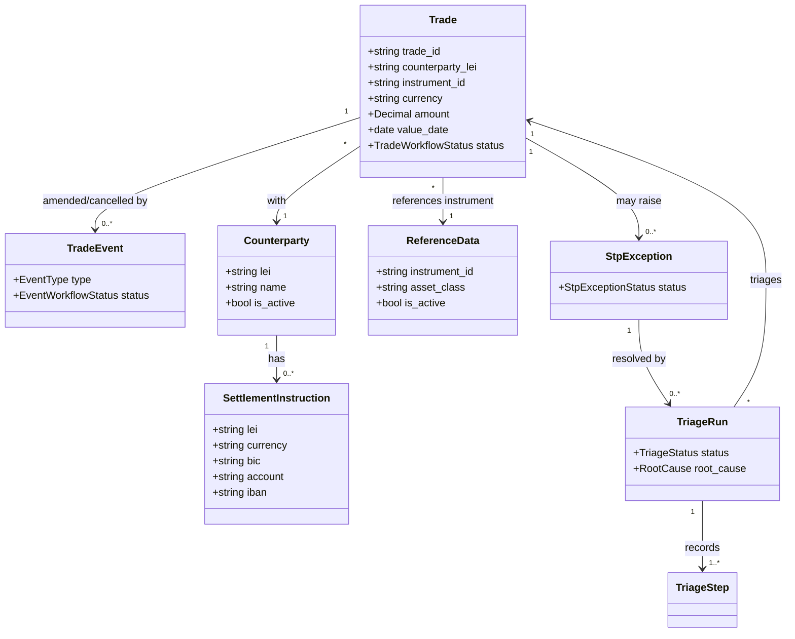
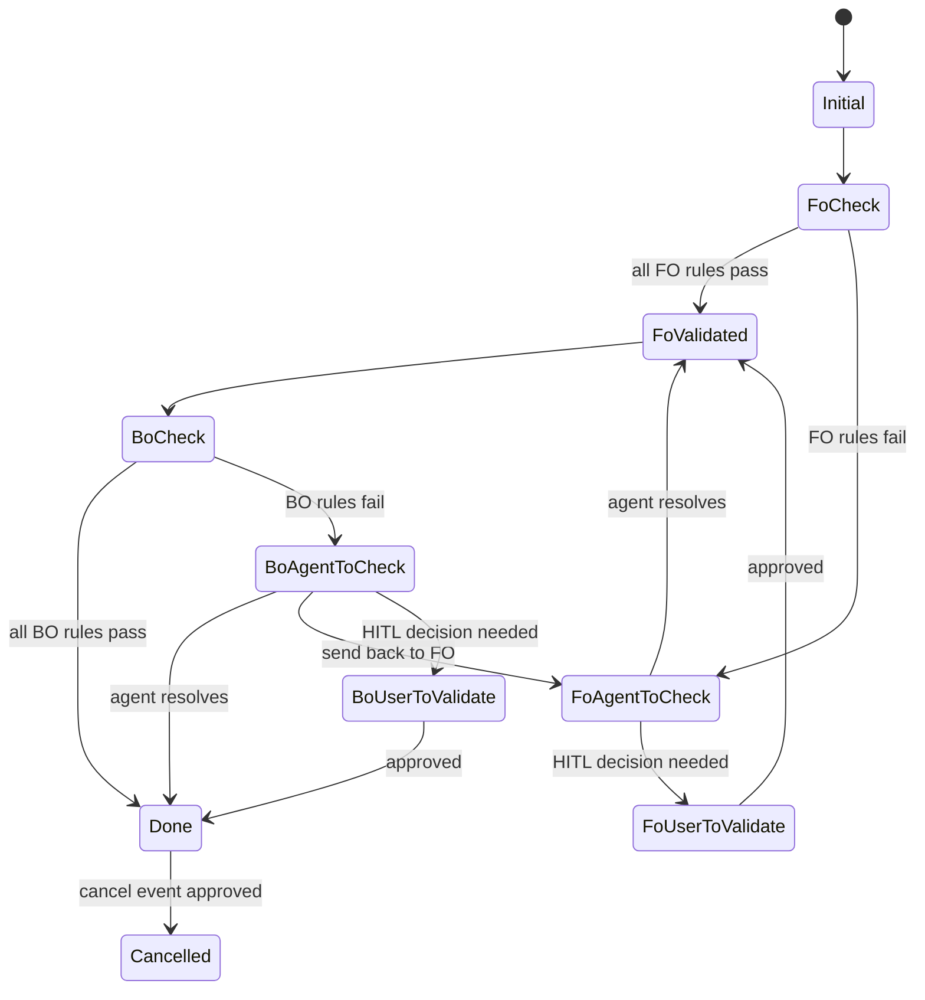

# Domain Model

The structure of the STP Exception Triage domain. Terms used here are defined in
`docs/domain/glossary.md`. This model is seeded from `src/domain/entities.py`
and `docs/architecture.md`, and is updated during the DDD phase.

## Entity relationships

## Trade workflow lifecycle

Mirrors `TradeWorkflowStatus` and the FO/BO triage flow in
`docs/architecture.md`.

## Aggregates and invariants

- **Trade** is the central aggregate. Its `TradeWorkflowStatus` is the
  authoritative lifecycle state; transitions happen only through rule checks,
  agent resolution, or approved HITL actions.
- A **write action that changes operational data is always HITL** (register SSI,
  reactivate counterparty, send back to FO, apply event). Agents propose; humans
  approve.
- While a trade is `EventPending`, manual FO/BO triage is blocked.
- **TriageRun** records every step for auditability; it never mutates a trade
  directly — it produces proposals and records outcomes.

## Notes for agents

- Treat the enums in `src/domain/entities.py` as canonical. If a feature needs a
  new status or root cause, update this model and the glossary in the DDD phase
  first, then the enum, then tests, then code.
- Keep the domain layer framework-light (no FastAPI, no SQLAlchemy in
  `src/domain/`), per `CLAUDE.md`.
